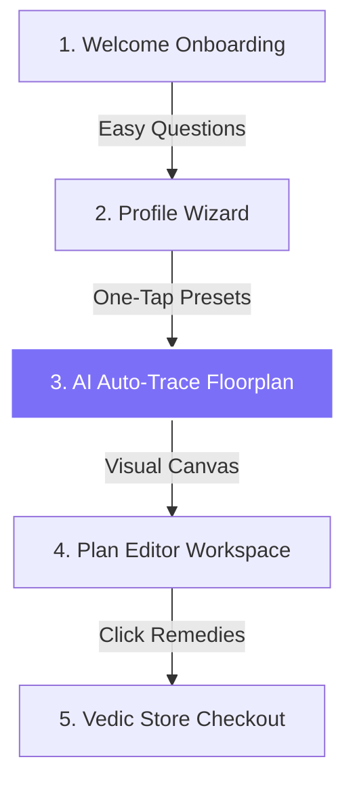
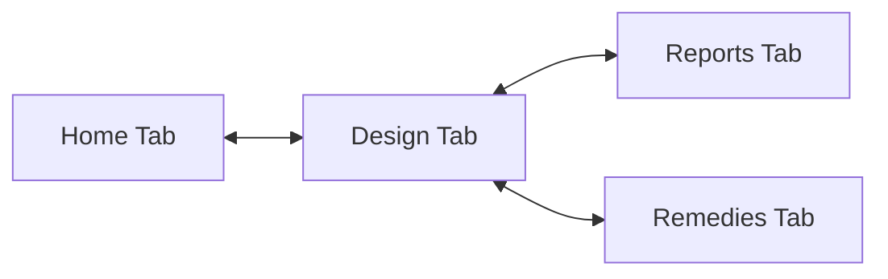

Platform:
BanjaraBazaarOS

Module:
Vastu Griha

Document:
UI/UX Guidelines

Version:
1.0

Status:
Review

Owner:
Product Team

Last Updated:
2026-07-01

---

## Platform Overview

BanjaraBazaarOS is the unified operating system powering all Banjara Bazaar digital products.

Current modules include:
• Marketplace
• Vendor Portal
• CRM
• Inventory
• Orders
• Payments
• Notifications
• AI Gateway
• RentPro
• Vastu Griha

Future modules may be added without affecting the platform architecture.

Vastu Griha is one module within this ecosystem and must always reuse shared platform services whenever possible.

---

## 1. Design Philosophy

Vastu Griha is a consumer-focused Vedic planning and blueprint audit utility. It is explicitly **not CAD (Computer-Aided Design) software**. Unlike AutoCAD, SketchUp, or professional architectural suites, which require structural, engineering, and spatial drafting experience, Vastu Griha is built for the everyday homeowner, their family, and local builders.

The design philosophy rests on the principle of **Simple Outside, Powerful Inside** through **Progressive Disclosure**:



### The Quad-Core App Experience Matrix
Vastu Griha operates at the intersection of four consumer design patterns:
1. **WhatsApp (The Conversation)**: Interface interactions with the AI (Vastu Acharya) must feel conversational, fast, and familiar. Complex Vastu rules are translated into human dialogue.
2. **Google Maps (The Navigation)**: Exploring the home layout is map-like. Pinch-to-zoom, pan, drag, and tilt controls must react instantly.
3. **Canva (The Creation)**: Placing rooms on the grid is drag-and-drop. Elements snap to a visual magnetic grid, hiding the geometry math.
4. **Amazon (The Action)**: The remedies store is a frictionless shopping catalog. Remedial products (copper wires, pyramids) are purchased to instantly improve the home's score.

### Anti-Complexity Rules
* **No Engineering Terminology**: Technical terms like *scale coordinates*, *vector polygons*, *anchor nodes*, *canvas canvas scale*, or *relative JSON state* are strictly banned from user-facing screens. 
* **Human-Centric Language**: The UI translates technical dimensions into plain words (e.g., instead of "Error: Overlapping Boundary Coordinate", the system alerts the user: *"This room is sticking out of your plot boundary. Let's nudge it inside!"*).

---

## 2. Product Experience Principles

Every interaction in Vastu Griha must adhere to these ten principles:

| Principle | Spec Requirement | Vastu Griha Implementation |
| :--- | :--- | :--- |
| **1. One Screen, One Job** | Limit cognitive load to a single primary action per viewport. | The onboarding wizard asks one question per step (e.g., Step 1: Property Type, Step 2: Dimensions). |
| **2. Primary Action Prominence** | Keep the next logical action obvious. | Every screen must have exactly one high-contrast Purple button (`var(--accent)`) placed in the thumb zone. |
| **3. Three Taps to Score** | The user should see their plot's Vastu score in 3 taps or less. | Welcome $\rightarrow$ Click recent plan $\rightarrow$ Immediate live score meter rendering. |
| **4. Touch-First Layouts** | Direct manipulation over form inputs. | Grid adjustments are made by dragging room blocks or using large direction arrows. |
| **5. Silent AI** | AI calculates calculations in the background. | AI analyzes compliance and updates the score meter silently without blocking the user. |
| **6. Total Editability** | Any element can be adjusted anytime. | Double-tapping a room opens its size controls; dragging it changes its sector location. |
| **7. Safe Exploration** | Prevent data loss from accidental taps. | Actions have history logs. Delete triggers a toast notification with an immediate "Undo" button. |
| **8. Real-time Autosave** | Save changes instantly. | Every move, resize, or setting change is saved to `localStorage` on completion. |
| **9. Human Explanations** | Compliance issues must have helpful guidance. | Warnings don't just say "Kitchen in NE is bad"; they explain *why* (fire in the water zone) and recommend remedies. |
| **10. Clear State Transitions** | Keep layout status visible. | Active selections are highlighted with an accent border and show an "Editing: [Room]" status bar. |

---

## 3. Mobile First Design

Vastu Griha is built to run on mobile browser viewports (`320px` to `480px` widths). Desktop layouts must adapt from this baseline.

```
+-----------------------------------+
| [X] Close        [Vastu Score 85%] |  <-- Header Zone (Sticky)
+-----------------------------------+
|                                   |
|        CANVAS VIEWPORT            |
|                                   |
|      [ Master Bedroom ]           |  <-- 70-80% viewport height
|                                   |
+-----------------------------------+
|  [Editing: Master Bed (15x12 ft)] |  <-- Active selection bar
|  Move:  [<-] [^] [v] [->]         |  <-- Thumb Zone Controls
|  Size:  [W+] [W-] [H+] [H-]       |
+-----------------------------------+
|  (Home)  (Design)  (+)  (Remedies) |  <-- Sticky Bottom Navigation
+-----------------------------------+
```

### Mobile Layout Specifications
* **Safe Area & Spacing**: Keep interactive components at least `16px` away from viewport edges to prevent accidental OS gestures (home bar, swipe-to-back).
* **Thumb Zone Mapping**:
  * **Green Zone (Easy Reach)**: Bottom 35% of the screen. Place the Nudge Controller, Add `+` FAB, and primary CTAs here.
  * **Yellow Zone (Stretched Reach)**: Middle 45% of the screen. Place the canvas view here.
  * **Red Zone (Hard Reach)**: Top 20% of the screen. Place toggle controls (Vastu Grid/Normal Grid) and profile indicators here.
* **Touch Targets**: All interactive elements (buttons, tiles, tabs, links) must have a minimum target size of `48px x 48px`, with at least `8px` of separation.
* **Keyboard Overlap Handling**: When a text input field gains focus, the footer and floating buttons must hide, allowing the scrolling container to slide up above the virtual keyboard.
* **Landscape Support**: Landscape mode is locked for the onboarding wizard, but enabled for the canvas editor to allow for wider floor plan views.

---

## 4. Desktop Experience

On desktop viewports (`1024px` and above), the screen splits into a three-pane layout:

```
+-------------------------------------------------------------------+
|  [Vastu Griha Logo]            [Tab Switchers]      [Print Report] |  <-- Sticky Header
+-------------------------------------------------------------------+
|  ELEMENTS      |                                |   VASTU STATUS  |
|  CATALOG       |        CANVAS VIEWPORT         |   PANEL         |
|  (Left Drawer) |                                |   (Right Pane)  |
|                |   +------------------------+   |                 |
|  [Bedroom]     |   | NW    | N      | NE    |   |  Score: [ 85% ] |
|  [Kitchen]     |   |-------|--------|-------|   |                 |
|  [Pooja]       |   | W     | C      | E     |   |  Positives (4)  |
|  [Bathroom]    |   |-------|--------|-------|   |  Warnings  (1)  |
|                |   | SW    | S      | SE    |   |                 |
|                |   +------------------------+   |  [Remedies]     |
+-------------------------------------------------------------------+
```

### Desktop Layout Rules
* **Pane Dimensions**:
  * **Left Catalog Drawer**: Fixed width `280px`. Contains categorized room tiles.
  * **Right Status Panel**: Fixed width `320px`. Displays compliance issues, remedy options, and suggestions.
  * **Center Canvas**: Flexes to fill the remaining screen space.
* **Large Monitor Handling**: For screens wider than `1600px`, scale the layout width to `1400px` and center it on the screen with a subtle background drop shadow.

---

## 5. Layout System

The layout system uses a strict 8px grid scale to maintain visual alignment across components.

| Spacing Token | Pixels | Rem Equivalent | Layout Usage |
| :--- | :--- | :--- | :--- |
| `space-xxs` | 4px | 0.25rem | Border radius, small badge padding |
| `space-xs` | 8px | 0.5rem | Room label margins, card gaps |
| `space-sm` | 12px | 0.75rem | Inner padding for lists and buttons |
| `space-md` | 16px | 1.0rem | Standard card padding, grid margins |
| `space-lg` | 24px | 1.5rem | Section gaps, wizard header margins |
| `space-xl` | 32px | 2.0rem | Canvas outer margins, welcome hero gaps |
| `space-xxl` | 48px | 3.0rem | Onboarding step transition padding |

### Grid Columns & Margins
* **Mobile Viewports (<768px)**: 4 columns, `16px` margins, `12px` gutters.
* **Tablet Viewports (768px - 1023px)**: 8 columns, `24px` margins, `16px` gutters.
* **Desktop Viewports (>=1024px)**: 12 columns, `32px` margins, `20px` gutters.

---

## 6. Typography

We use two primary typefaces:
1. **Outfit (Google Fonts)**: A geometric sans-serif used for headings, scores, and welcome dashboard labels.
2. **Inter (System Font Fallback)**: A highly legible sans-serif optimized for inputs, parameters, chat conversations, and body copy.
3. **Fira Code (Optional)**: A monospaced font used specifically for displaying room dimensions (e.g., `15x12 ft`).

```
Header Style:   [ Outfit Bold - 24px ]  ->   Pooja Mandir
Body Style:     [ Inter Regular - 14px ] ->   Auapicious facing East.
Dimension:      [ Fira Code - 11px ]    ->   15x12 ft
```

### Typographic Hierarchy Scale

| Token | Font Family | Size (px) | Weight | Line Height | CSS Application |
| :--- | :--- | :--- | :--- | :--- | :--- |
| `font-h1` | Outfit | 32px | 700 (Bold) | 1.2 | Welcome Hero Banner |
| `font-h2` | Outfit | 24px | 700 (Bold) | 1.3 | Onboarding Step Headers |
| `font-h3` | Outfit | 18px | 600 (Semibold) | 1.4 | Sidebar Pane Titles |
| `font-body` | Inter | 14px | 400 (Regular) | 1.5 | General Text, Acharya Chat |
| `font-body-sm` | Inter | 12px | 400 (Regular) | 1.5 | Subtext, Card descriptions |
| `font-caption` | Inter | 11px | 500 (Medium) | 1.4 | Badge Labels, Compass Titles |
| `font-dimension`| Fira Code | 10px | 600 (Semibold) | 1.0 | Room measurements on canvas |

---

## 7. Color System

Vastu Griha uses a color system centered around dark slate surfaces (`--bg` and `--bg2`) to create a premium, high-contrast feel, combined with dynamic compliance status indicators.

### Core Color Tokens

```
Primary:    [#7C6FF7] --accent
Vastu Good: [#10B981] --green
Vastu Warning:[#F59E0B] --yellow
Vastu Poor: [#EF4444] --red
Surface:    [#1C1D20] --bg2
```

| Token | Hex Value | Application |
| :--- | :--- | :--- |
| `var(--bg)` | `#0C0D10` | Base background color |
| `var(--bg2)` | `#1C1D20` | Surface color for cards, drawers, and panels |
| `var(--accent)` | `#7C6FF7` | Primary action button, active selection borders |
| `var(--accent-dim)`| `rgba(124,111,247,0.15)` | Selected element canvas glowing shadows |
| `var(--border)` | `#2E3036` | Card borders, grid separators |
| `var(--text)` | `#F8FAFC` | Main headings, highlighted values |
| `var(--text2)` | `#94A3B8` | Body copy, secondary titles |
| `var(--text3)` | `#64748B` | Disabled states, auxiliary labels |
| `var(--gold)` | `#EAB308` | Chat assistant highlights, premium brand markings |

### Vastu Compliance Indicators
* **Excellent / Auspicious**: `#10B981` (Green). Used for compliant room placements (e.g. Master Bedroom in South-West).
* **Average / Acceptable**: `#3B82F6` (Blue). Used for neutral room placements.
* **Warning / Correction Needed**: `#F59E0B` (Amber). Used for non-compliant placements that can be corrected with remedies (e.g. Kitchen in South-West).
* **Critical / Non-Compliant**: `#EF4444` (Red). Used for placements that require immediate attention (e.g. Bathrooms in the North-East).

---

## 8. Icons

We use icons from the **Tabler Icons** library (`@tabler/icons-react` or SVG class wrappers).

```
[ti-home-2]       [ti-layout-grid]     [ti-shopping-cart]    [ti-file-text]
  Home Nav           Design Nav           Remedies Nav          Reports Nav
```

### Icon Design Constraints
* **Format**: Pure inline SVG only. Do not use icon fonts (`.woff`/`.ttf`) to prevent scaling artifacts.
* **Line Weight**: `2px` stroke width, using rounded joins (`stroke-linejoin: round`, `stroke-linecap: round`).
* **Sizing Rules**:
  * Navigation Bar Items: `22px x 22px`
  * Action Buttons: `16px x 16px`
  * Room Card Tiles: `20px x 20px`
  * Welcome Banner Hero Indicators: `32px x 32px`

---

## 9. Buttons

Every button in Vastu Griha must fall into one of these six categories:

| Button Style | Preview Anatomy | Background / Text Color | Tap Event Usage |
| :--- | :--- | :--- | :--- |
| **Primary** | `[ 🪄 Action Text ]` | `var(--accent)` / `#FFF` | Core step progression, AI layout triggers |
| **Secondary** | `[ Secondary Action ]` | `var(--bg2)` / `var(--text2)` | Cancel triggers, backdrop alignment adjustments |
| **Ghost** | `[ Flat link ]` | Transparent / `var(--accent)` | Toggle settings, view details |
| **Danger** | `[ 🗑️ Delete ]` | `rgba(239,68,68,0.15)` / `#EF4444` | Room exclusions, canvas resets |
| **Outline** | `[ Grid Border ]` | Transparent / `var(--border)` | Layout mode options (Vastu Grid / Normal Grid) |
| **FAB (Floating)**| `[ + ]` | Circular `var(--accent)` / `#FFF` | Adding canvas elements on mobile |

---

## 10. Cards

Cards organize information into readable, distinct blocks. The padding, border, and background of cards must follow these specifications:

```
+-----------------------------------+
|  [Icon] Master Bedroom            |  <-- Card Header
|  Complies with SW Nairutya Zone   |  <-- Description
|                                   |
|  [ Excellent Vastu ]              |  <-- Status Pill
+-----------------------------------+
```

### Card Types & Specifications

* **Room Card**: Renders placed room elements on the canvas.
  * *Specification*: `background: rgba(28, 29, 32, 0.85)`, border `#2E3036`, text color is always forced to soft white (`#f8fafc`) to remain readable against the dark background.
* **Analysis Card**: Displays directional audit warnings.
  * *Specification*: Border matches the Vastu status color (Green, Blue, Amber, Red). Displays warning explanations and correction advice.
* **Product Card**: Renders Vedic remedies in the Shop.
  * *Specification*: Features product thumbnail drawings, prices, Vastu rating increments (e.g. `+15% Score`), and a quick "Buy Now" checkout button.

---

## 11. Inputs

Input fields must be designed to minimize typing on mobile viewports.

```
Text Input:     [ Enter custom name...       ]
Range Slider:   Scale: 1.25  [========o-------]
Direction Card: [ East ]  [ West ]  *[ North ]*  [ South ]
```

### Input Interaction Rules
* **Sliders**: Opacity, scale, and compass rotation use range input sliders with a minimum touch height of `24px` to allow for easy adjustments.
* **Direction Picker**: Grid facing selection uses a segmented selector rather than a dropdown menu. The selected direction is highlighted with an active border.
* **Compass Tilt Picker**: Tilt adjustments are made using a horizontal slider (`-18°` to `+18°`) with a visual dial indicator.

---

## 12. Bottom Sheets

Bottom sheets slide up from the bottom of the screen on mobile viewports, keeping workflows focused.

```
+-----------------------------------+
|             ===                   |  <-- Drag Handle (36px wide, 4px thick)
|  Add Element (Catalog)            |  <-- Header
|  [ Search elements...          ]  |  <-- Filter Input
|                                   |
|  [Bed] Master    [Sofa] Living    |  <-- 3-Column Scroll Grid
|  [Cook] Kitchen  [Flame] Pooja    |
+-----------------------------------+
```

### Bottom Sheet Behavior
* **Drag Handle**: An indicator pill (`36px` wide, `4px` tall) must be centered at the top of the sheet.
* **Dismiss Gesture**: Sweeping down on the drag handle slides the sheet down and dismisses it.
* **Mobile Columns**: Room categories in the bottom sheet must render in a **3-column layout** with text truncation to prevent layout crowding.

---

## 13. Navigation

Navigation transitions are designed to be simple and easy to reach on mobile devices.



### Navigation Rules
* **Tabs Navigation**: On mobile viewports, the bottom navigation bar is locked to the bottom of the screen, with active states highlighted in purple (`var(--accent)`).
* **Side Navigation**: On desktop, the bottom navigation bar is hidden. Users navigate using the left sidebar menu instead.

---

## 14. Motion & Transitions

Animations are used to make layout transitions feel smooth and natural.

### Transition Scales
* **UI Tab Fade**: `200ms` duration using `ease-out`. Smooth opacity cross-fade when switching tabs.
* **Bottom Sheet Slide-Up**: `300ms` duration using a spring cubic-bezier curves (`cubic-bezier(0.16, 1, 0.3, 1)`).
* **Scan Overlay Line**: The AI Auto-Trace scanner animates vertically (`top: 0%` to `top: 100%`) over a `2s` loop to provide feedback during scanning.

---

## 15. Accessibility (a11y)

Vastu Griha is designed to be highly accessible for all users, including older family members and builders.

### Accessibility Specs
* **Contrast Ratios**: Main headings and parameters must maintain a contrast ratio of at least `4.5:1` against the dark surface background.
* **Forced Contrast inside Placed Rooms**: Because canvas room blocks use a dark charcoal background (`rgba(28, 29, 32, 0.85)`), text label colors are forced to soft white (`#f8fafc`) in both Light and Dark modes to ensure legibility.
* **Large Touch Area Padding**: Interactive elements have a minimum size of `48px` to accommodate users with limited dexterity.

---

## 16. Empty States

Empty states are designed to guide the user toward their next action rather than showing blank screens.

```
+-----------------------------------+
|               🏠                  |  <-- Large outline icon
|       No houses planned yet       |  <-- Title
|  Start by drafting your plot shape |  <-- Helpful instructions
|                                   |
|       [ Create New Plot ]         |  <-- Clear primary CTA button
+-----------------------------------+
```

### Empty State Scenarios

* **Welcome Dashboard (First Load)**:
  * *UI Implementation*: Display a house icon, helper text (*"No houses planned yet. Start your Vastu journey below!"*), and a primary button leading to the property wizard.
* **Remedies Shop (No Warnings)**:
  * *UI Implementation*: Display a green checkmark icon (*"Your house is fully Vastu compliant. No remedies needed!"*).

---

## 17. Loading States

Loading indicators provide feedback during background operations to keep the user informed.

### Loading Visual Rules
* **Progress Bar**: Displays loading percentages (e.g. `25%`, `50%`) with clear status messages during plot calculations.
* **AI Thinking Indicator**: The chat interface displays typing bubbles (`...`) while the assistant generates responses.

---

## 18. Illustrations

Illustrations are designed to make the onboarding process engaging and premium.

```
Sunset landscape background -> Gradient sky (#7c6ff7 to #ea580c)
Flat-roof modern villa      -> Monochromatic white / light grey facades
Ground palm tree details    -> Clean stroke nodes (#cbd5e1)
```

### SVG Vector Design Guidelines
* **Color Scheme**: Uses a violet-to-orange gradient sky background, with white architectural facades and clean grey vector details.
* **Pastel Cards**: Action cards on the onboarding dashboard use soft pastel background colors with connecting vector details (e.g. purple document sheets, robot heads, magnifying lenses).

---

## 19. Photography

Product photography is optimized for fast load times and clean presentation.

* **Format**: Highly compressed WebP format for fast loads.
* **Styling**: Remedy product images must be shown on a clean, solid background matching the card surface color (`#1c1d20`).

---

## 20. Design Do's & Don'ts

### Do
* Do use the dynamic nudge buttons to adjust room positions on mobile devices.
* Do keep room text label colors forced to white for legibility on dark room blocks.
* Do hide the bottom navigation bar on desktop viewports.

### Don't
* Don't use raw hex colors or inline style overrides that ignore theme variables.
* Don't display technical terms like *X/Y coordinates* or *pixel boundaries* to the user.
* Don't use low-contrast text colors on room canvas cards.

---

## 21. Future Design Rules

* **Tablet Layouts**: Flex layout to a split-pane presentation, keeping the sidebar open on viewports wider than `768px`.
* **Augmented Reality (AR) Overlay**: A future mode that allows the user to overlay the 3x3 Vastu grid onto their site using their mobile camera.

---

## Related Documents
* [Master Product Spec](file:///c:/Users/DELL/BanjaraBazaarOS/apps/vastu-griha/docs/01_Master_Product_Spec_v1.0.md)
* [UI/UX Guidelines](file:///c:/Users/DELL/BanjaraBazaarOS/apps/vastu-griha/docs/02_UI_UX_Guidelines_v1.0.md)
* [Component Library](file:///c:/Users/DELL/BanjaraBazaarOS/apps/vastu-griha/docs/03_Component_Library_v1.0.md)
* [Asset Pipeline](file:///c:/Users/DELL/BanjaraBazaarOS/apps/vastu-griha/docs/04_Asset_Pipeline_v1.0.md)
* [AI Prompt Library](file:///c:/Users/DELL/BanjaraBazaarOS/apps/vastu-griha/docs/05_AI_Prompt_Library_v1.0.md)
* [Engineering Guidelines](file:///c:/Users/DELL/BanjaraBazaarOS/apps/vastu-griha/docs/06_Engineering_Guidelines_v1.0.md)
* [Database & API](file:///c:/Users/DELL/BanjaraBazaarOS/apps/vastu-griha/docs/07_Database_API_v1.0.md)
* [Analytics](file:///c:/Users/DELL/BanjaraBazaarOS/apps/vastu-griha/docs/08_Analytics_and_Events_v1.0.md)
* [Error States](file:///c:/Users/DELL/BanjaraBazaarOS/apps/vastu-griha/docs/09_Error_States_v1.0.md)
* [Deployment](file:///c:/Users/DELL/BanjaraBazaarOS/apps/vastu-griha/docs/10_Deployment_Performance_v1.0.md)
