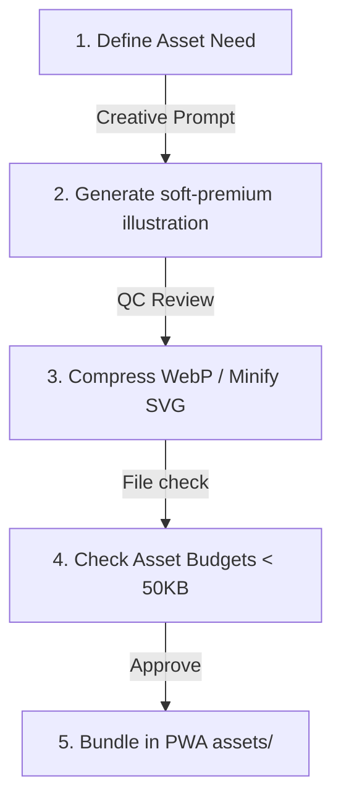
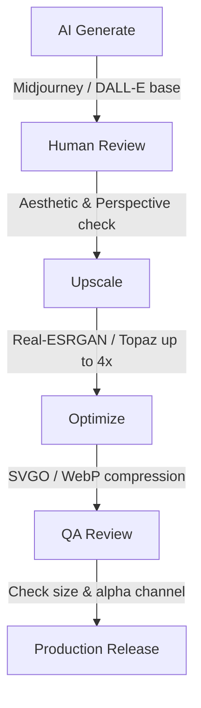
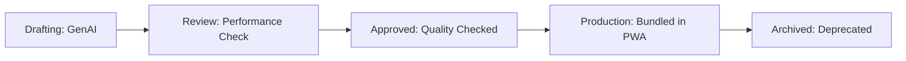

# Vastu Griha — Asset Pipeline Specification v1.0

**Status**: Approved / Engineering & Design System Spec  
**Version**: 1.0  
**Authors**: Principal Creative Director, Lead Frontend Performance Engineer  

---

## 1. Asset Philosophy

Visual assets in Vastu Griha must adhere to three core pillars:
1. **Performance-First**: The application is an installable PWA designed for mobile networks. Total initial load size of assets must remain under **1.5MB**. All imagery must load via optimized formats (WebP/SVG) with lazy loading enabled.
2. **Mobile-First**: Vectors and symbols must render cleanly on low-resolution mobile viewports without details washing out.
3. **Consistency-First**: All illustrations and icons must speak the same visual language: **Soft Premium 3D** (pastel colors, rounded corners, warm, studio-lighting feel) to convey a premium, trustworthy Vedic atmosphere.



---

## 2. Folder Structure

All application assets are located in `apps/vastu-griha/docs/assets/`. The folder structure is laid out as follows:

```
docs/assets/
├── icons/             # Custom inline SVG icons
├── illustrations/     # Pastel vectors for onboarding screens
├── products/          # Vedic remedies shop images
├── rooms/             # Placed room templates symbols
├── objects/           # Internal furniture assets
├── backgrounds/       # Sunrise and landscape gradients
├── patterns/          # Visual grids, Vastu mandalas
├── textures/          # Floor tile and backdrop layers
├── avatars/           # Collaborator initial avatars
├── acharya/           # Vastu guru chat illustrations
├── loading/           # AI scan loaders & progress animations
├── animations/        # Lottie JSON config files
├── logos/             # Brand identity icons
├── wireframes/        # Flow layouts
├── diagrams/          # Architecture, Database diagrams
└── references/        # User feedback recordings
```

---

## 3. Naming Convention

To ensure that assets are instantly searchable across our codebase, the project uses a strict namespace convention:

`[category]_[subcategory]_[description]_[version].[extension]`

### Naming Namespace Rules
* **Lowercase Only**: Characters must be lowercase; spaces are replaced with underscores (`_`).
* **Category Prefix**: Must start with a category descriptor from the table below:

| Category Prefix | Usage | Code Example |
| :--- | :--- | :--- |
| `icon_` | Inline SVG UI icons | `icon_chevron_right_v1.svg` |
| `illus_` | Onboarding/Welcome illustrations | `illus_hero_villa_v1.webp` |
| `product_` | Remedies shop item photos | `product_copper_wire_50m_v1.webp` |
| `room_` | Placed room templates | `room_bedroom_master_v1.svg` |
| `anim_` | Lottie/GIF loop animations | `anim_ai_scanning_v1.json` |

---

## 4. Asset ID System

To facilitate programmatic lookups, strict version tracking, and clear database mappings, every asset in the Vastu Griha ecosystem must have a unique identifier.

### ID Format
`[CATEGORY_PREFIX]-[THREE_DIGIT_ID]` (e.g., `ILL-001`, `ICO-001`, `PROD-001`, `ANIM-001`)

### Category Prefixes
* **`ILL`**: Illustrations (Onboarding graphics, header illustrations)
* **`ICO`**: UI Icons (Standard application action and navigation icons)
* **`PROD`**: Product Images (Remedies in the shop catalog)
* **`ANIM`**: Animations (Lottie JSON sequences)
* **`ROOM`**: Room templates (Bedroom, Kitchen, Pooja room outlines)
* **`OBJ`**: Room Objects (Doors, windows, utility fixtures)
* **`SVG`**: SVG Canvas elements (Guides, compass, resize handles)
* **`MKT`**: Marketing Assets (Social media banners, email designs)

### Naming and Lookup Rules
1. **Uniqueness**: Every Asset ID must map to a single unique asset file in the registry.
2. **Case Sensitivity**: Lookups are case-insensitive, but in all documentation, configuration, and registry tables, Asset IDs must be specified in uppercase.
3. **Sequential Assignment**: New assets must be assigned the next available sequential number within their category.
4. **Lookup Map**: The application maintainer utilizes JSON map files in `src/assets/registry.json` matching the Asset ID key to its current CDN/bundle file path.
5. **Immutability**: Once an ID is assigned and released to production, it cannot be reassigned to a different asset type. If an asset is replaced, the ID remains the same, but the version increments.

---

## 5. Asset Registry Tables

These registries represent the authoritative list of current assets used across the application components.

### Illustrations Registry (`ILL`)
| ID | Filename | Purpose | Format | Resolution | Status | Version |
| :--- | :--- | :--- | :--- | :--- | :--- | :--- |
| `ILL-001` | `illus_hero_villa_v1.webp` | Dashboard Greeting / Welcome screen | WebP | 800x600 | Production | 1.0 |
| `ILL-002` | `illus_upload_blueprint_v1.webp` | Blueprint Uploader background | WebP | 800x600 | Production | 1.0 |
| `ILL-003` | `illus_ai_assistant_v1.webp` | AI chatbot & audit steps | WebP | 600x600 | Production | 1.0 |
| `ILL-004` | `illus_audit_checklist_v1.webp` | Visual review checklist header | WebP | 600x600 | Production | 1.0 |
| `ILL-005` | `illus_shop_remedies_v1.webp` | Vedic remedy shop banner | WebP | 800x600 | Production | 1.0 |

### Icons Registry (`ICO`)
| ID | Filename | Purpose | Format | Resolution | Status | Version |
| :--- | :--- | :--- | :--- | :--- | :--- | :--- |
| `ICO-001` | `icon_chevron_right_v1.svg` | Next page navigation arrow | SVG | 24x24 | Production | 1.0 |
| `ICO-002` | `icon_home_v1.svg` | Main dashboard navigation | SVG | 24x24 | Production | 1.0 |
| `ICO-003` | `icon_remedies_v1.svg` | Shop tab icon | SVG | 24x24 | Production | 1.0 |
| `ICO-004` | `icon_audit_v1.svg` | Audit checklist tab icon | SVG | 24x24 | Production | 1.0 |
| `ICO-005` | `icon_settings_v1.svg` | App settings and profile tab | SVG | 24x24 | Production | 1.0 |

### Product Images Registry (`PROD`)
| ID | Filename | Purpose | Format | Resolution | Status | Version |
| :--- | :--- | :--- | :--- | :--- | :--- | :--- |
| `PROD-001` | `product_copper_wire_50m_v1.webp` | Copper wire remedy image | WebP | 400x400 | Production | 1.0 |
| `PROD-002` | `product_brass_helix_v1.webp` | Brass helix Vastu remedy | WebP | 400x400 | Production | 1.0 |
| `PROD-003` | `product_lead_pyramid_v1.webp` | Lead pyramid Vastu tool | WebP | 400x400 | Production | 1.0 |
| `PROD-004` | `product_camphor_diffuser_v1.webp` | Electric diffuser for Vastu clearing | WebP | 400x400 | Production | 1.0 |

### Animations Registry (`ANIM`)
| ID | Filename | Purpose | Format | Resolution | Status | Version |
| :--- | :--- | :--- | :--- | :--- | :--- | :--- |
| `ANIM-001` | `anim_thinking_v1.json` | Background AI processing animation | Lottie | Scalable | Production | 1.0 |
| `ANIM-002` | `anim_scanning_v1.json` | Visual overlay for layout scanner | Lottie | Scalable | Production | 1.0 |
| `ANIM-003` | `anim_success_v1.json` | Feedback score upgrade animation | Lottie | Scalable | Production | 1.0 |

### Room Objects Registry (`ROOM` / `OBJ`)
| ID | Filename | Purpose | Format | Resolution | Status | Version |
| :--- | :--- | :--- | :--- | :--- | :--- | :--- |
| `ROOM-001` | `room_bedroom_master_v1.svg` | Southwest bedroom layout template | SVG | Vector | Production | 1.0 |
| `ROOM-002` | `room_kitchen_cook_v1.svg` | Southeast cooking layout template | SVG | Vector | Production | 1.0 |
| `ROOM-003` | `room_kids_bedroom_v1.svg` | Northwest kids bedroom layout | SVG | Vector | Production | 1.0 |
| `ROOM-004` | `room_pooja_mandir_v1.svg` | Northeast temple layout | SVG | Vector | Production | 1.0 |
| `ROOM-005` | `room_staircase_v1.svg` | Staircase block layout | SVG | Vector | Production | 1.0 |
| `ROOM-006` | `room_toilet_bath_v1.svg` | Bathroom / Toilet template | SVG | Vector | Production | 1.0 |
| `OBJ-001` | `obj_door_standard_v1.svg` | Primary door placement object | SVG | Vector | Production | 1.0 |
| `OBJ-002` | `obj_window_standard_v1.svg` | Window placement object | SVG | Vector | Production | 1.0 |
| `OBJ-003` | `obj_ventilator_v1.svg` | Ventilator placement object | SVG | Vector | Production | 1.0 |
| `OBJ-004` | `obj_exhaust_fan_v1.svg` | Kitchen/bathroom exhaust fan | SVG | Vector | Production | 1.0 |

---

## 6. Image Formats

| Format | Allowed Usage | Prohibited Usage | Target Bitrate / Quality |
| :--- | :--- | :--- | :--- |
| **SVG** | Vector icons, room templates, brand logos, grid overlays. | Do not use for product photos or complex gradients. | XML minified via SVGO. |
| **WebP** | Onboarding illustrations, remedies product images, user avatars. | Do not use for crisp text-only logos. | Quality 80% lossy. |
| **Lottie (JSON)**| UI loop animations, scanner paths, score check success loops. | Do not use for background screens. | Under 100KB payload. |
| **JPEG / PNG** | Standard fallback options when WebP is unsupported. | Do not use as primary format. | Quality 70% compressed. |

---

## 7. Illustration Library

Every illustration category in Vastu Griha must align with the **Soft Premium 3D** design system:

| Illustration Category | Core Purpose | Midjourney Prompt Style | camera / Lighting |
| :--- | :--- | :--- | :--- |
| **`illus_home`** | Dashboard Greeting | *"Modern double-story luxury villa, white facade, flat roof, sunset gradient sky, soft clay texture"* | Isometric, Studio light |
| **`illus_upload`** | Backdrop blueprint uploader | *"Folded paper sheet blueprint, purple upload badge overlay, pastel background"* | Orthographic, Warm light |
| **`illus_ai`** | AI wizard steps | *"Friendly robot head, round features, copper metallic eyes, glowing aura"* | Front-facing, Studio light |
| **`illus_audit`** | Visual checklist reviews | *"Gold magnifying lens focusing on a miniature clay house, green checkmarks"* | Close-up, Soft shadows |
| **`illus_shop`** | Remedies shop tab | *"Clay treasure chest open, glowing gold light, copper wires and crystals inside"* | High angle, Warm light |

---

## 8. Icon Library

* **Format**: XML-minified inline SVGs only.
* **Vector Constraints**: Stroke weight `2px`, corner radius `6px` on borders, centered viewbox bounds `0 0 24 24`.
* **Standard Dimensions**:
  * Navigation Bar: `22px x 22px`
  * Action Buttons: `16px x 16px`
  * Badges / Tags: `12px x 12px`

---

## 9. SVG Asset Library

The canvas editing engine overlays specialized vector objects to assist users with layout editing, navigation, and measurement. These assets must render pixel-perfect paths and scale fluidly.

### SVG Asset Specifications
* **`svg_compass` (ID: SVG-001)**:
  * *Purpose*: A rotating directional rose overlaid on the layout grid to help users locate positive/negative energy axes.
  * *Design Style*: Thin circular outlines (`stroke-width: 1px`), clean geometric markers for the 8 major cardinal directions (N, E, S, W, NE, SE, NW, SW), with the North needle highlighted in warm orange.
* **`svg_direction_arrows` (ID: SVG-002)**:
  * *Purpose*: Visual flow indicators illustrating energy currents (e.g., solar flow from East to West, magnetic flow from North to South).
  * *Design Style*: Dashed line bodies with filled arrowheads, opacity set to `0.6` to avoid cluttering the blueprint view.
* **`svg_room_labels` (ID: SVG-003)**:
  * *Purpose*: Text elements displayed on the canvas marking room name, dimensions, and dynamic compliance percentage.
  * *Design Style*: Framed within a soft pill-shaped container using the *Outfit* typeface, styled dynamically based on score status (Green for high Vastu score, Amber for warning, Red for high violation).
* **`svg_grid_lines` (ID: SVG-004)**:
  * *Purpose*: The classic 9x9 (81 Pada) Vastu Mandala grid overlay.
  * *Design Style*: Ultra-thin lines (`stroke-width: 0.75px`), light dashed style, opacity set to `0.15` to serve as a subtle reference guideline.
* **`svg_measurement_lines` (ID: SVG-005)**:
  * *Purpose*: Interactive dimension lines displaying the length of wall boundaries and spacing gaps.
  * *Design Style*: Terminal tick marks (`/`) on both ends, solid gray path with a floating text background label showing active measurements in feet.
* **`svg_resize_handles` (ID: SVG-006)**:
  * *Purpose*: Interactive knobs located on corners of selected room blocks for adjusting dimensions.
  * *Design Style*: Circular handles with a `6px` radius, `#FFFFFF` fill, and `#2C3E50` outline. Mouse hover triggers the corresponding diagonal cursor.
* **`svg_rotation_handles` (ID: SVG-007)**:
  * *Purpose*: An action pin extending from the center of selected items to facilitate 360-degree rotation.
  * *Design Style*: A single line leading to a circular icon featuring a curved rotation arrow.
* **`svg_selection_handles` (ID: SVG-008)**:
  * *Purpose*: Highlight bounding box indicating that a room or object is currently selected.
  * *Design Style*: Solid bright blue boundary (`#3498DB`), `stroke-width: 1.5px` with a slight outer glow effect.

---

## 10. Room Objects

Standard room blocks mapped to coordinate percentages inside the canvas engine:

```
[ Master Bedroom ] -> (SW) - size: 30x25% - Nairutya (Earth)
[ Kids Bedroom ]   -> (NW) - size: 25x25% - Vayu (Wind)
[ Parents Bedroom] -> (NE) - size: 25x25% - Ishanya (Water)
[ Kitchen Cook ]   -> (SE) - size: 22x22% - Agni (Fire)
```

### Room Parameters Table

| Room ID | Catalog Type | Label | Default Dimensions | Default Zone |
| :--- | :--- | :--- | :--- | :--- |
| `bedroom_master` | Private | Master Bedroom | 30 x 25 ft | South-West (SW) |
| `bedroom_kids` | Private | Kids Bedroom | 25 x 25 ft | North-West (NW) |
| `kitchen_cook` | Utility | Kitchen Cooktop | 22 x 22 ft | South-East (SE) |
| `pooja_mandir` | Vedic | Pooja Temple | 15 x 15 ft | North-East (NE) |
| `staircase_block`| Vedic | Staircase | 15 x 25 ft | South (S) / West (W) |
| `toilet_bath` | Utility | Bathroom / Toilet | 18 x 15 ft | West (W) / North-West (NW) |

---

## 11. Expanded Room Object Library

The planner canvas supports structural, utility, and decorative assets. These elements are mapped to the canvas coordinates and evaluated for Vastu compliance based on their placement zones.

| ID | Object Label | Catalog Type | Default Dimensions (W x H) | Default/Preferred Zone | Vastu Relevance & Rules | Format |
| :--- | :--- | :--- | :--- | :--- | :--- | :--- |
| `OBJ-001` | **Door** | Structural | 3 x 7 ft | North (N) / East (E) | Main entrance must face positive zones; avoid Southwest. | SVG |
| `OBJ-002` | **Window** | Structural | 4 x 4 ft | North (N) / East (E) | Openings preferred in East/North to receive morning light. | SVG |
| `OBJ-003` | **Ventilator** | Structural | 2 x 1.5 ft | North-West (NW) | Promotes airflow; excellent in kitchen/bathroom zones. | SVG |
| `OBJ-004` | **Exhaust Fan** | Utility | 1.5 x 1.5 ft | South-East (SE) / NW | Extracts heat/vapors; ideal for cooking and bath zones. | SVG |
| `OBJ-005` | **Column** | Structural | 1.5 x 1.5 ft | South (S) / West (W) | Heavy weight-bearing load; avoid placing in Brahmasthan. | SVG |
| `OBJ-006` | **Beam** | Structural | 1 x 20 ft | South (S) / West (W) | Avoid placing directly over beds or seating areas. | SVG |
| `OBJ-007` | **Balcony** | Structural | 10 x 4 ft | East (E) / North (N) | Open, light spaces; should not be in Southwest. | SVG |
| `OBJ-008` | **Utility Shaft**| Utility | 3 x 3 ft | North-West (NW) | Handles plumbing stack; must not overlap Pooja room wall. | SVG |
| `OBJ-009` | **Water Tank** | Utility | 5 x 5 ft (Round) | North-East (NE) | Underground water sources belong strictly to NE. | SVG |
| `OBJ-010` | **Septic Tank** | Utility | 6 x 4 ft | North-West (NW) | Waste storage; prohibited in NE, SW, and Brahmasthan. | SVG |
| `OBJ-011` | **Borewell** | Utility | 1 x 1 ft | North-East (NE) | Pure water source; must reside in E, N, or NE. | SVG |
| `OBJ-012` | **Solar Panels**| Utility | 15 x 6 ft | South (S) / South-West | Solar heat absorption matches southern solar axis. | SVG |
| `OBJ-013` | **EV Charger**  | Utility | 1.5 x 2 ft | South-East (SE) | Electrical infrastructure maps to Agni (Fire) zone. | SVG |
| `OBJ-014` | **Compound Wall**| Structural | Variable length | SW (Thicker/Higher)| SW wall must be thicker and taller than NE wall. | SVG |
| `OBJ-015` | **Gate** | Structural | 10 x 6 ft | North (N) / East (E) | External gate entry; align with auspicious Vastu grids. | SVG |
| `OBJ-016` | **Road** | Infrastructure| Variable width | N / E (Approaches) | External approach roads determine flow of energy. | SVG |
| `OBJ-017` | **Tree** | Landscape | 6 x 6 ft (Canopy) | South (S) / West (W) | Large, heavy trees should be placed in S or W zones. | SVG |
| `OBJ-018` | **Boundary Marker**| Structural| 0.5 x 0.5 ft | All Corners | Identifies plot boundaries for mandala layout. | SVG |

---

## 12. Product Images & Types

Remedy products listed in the Shop must follow these guidelines:
* **Background**: Solid color matching the card surface background (`#1C1D20`) or transparent background with a soft drop shadow.
* **Angles**: Standard 3/4 perspective view showing product width, height, and depth.
* **Resolution**: Locked to `400px x 400px` WebP, compressed to quality level `75%` to keep page loads under 25KB per product.

### Product Image Types & Standards
To ensure comprehensive visuals on our shop and product detail pages, designers must supply six distinct image configurations for each product remedy:

1. **Hero Image (`PROD_HERO_`)**:
   * *Standard*: Main shop thumbnail. Placed on a dark slate (`#1C1D20`) background with a 3/4 perspective layout. Soft, warm diffused studio lighting.
   * *Format*: WebP, `400px x 400px`, target size `< 20KB`.
2. **Gallery Image (`PROD_GALLERY_`)**:
   * *Standard*: Detail close-ups showcasing material quality, rear views, dimensions, and texture details.
   * *Format*: WebP, `600px x 600px`, target size `< 35KB`.
3. **Lifestyle Image (`PROD_LIFESTYLE_`)**:
   * *Standard*: Visualizes the remedy in context (e.g. copper wires installed along floor joints, a brass helix mounted on a Southeast kitchen wall).
   * *Format*: WebP, `800px x 600px`, target size `< 50KB`.
4. **Placement Preview (`PROD_PREVIEW_`)**:
   * *Standard*: Simplified SVG drawing or miniature representation for overlaying on the 2D layout planner canvas.
   * *Format*: SVG, vector, target size `< 5KB`.
5. **Transparent Product Cutout (`PROD_CUTOUT_`)**:
   * *Standard*: The product isolation on a transparent background (`rgba(0,0,0,0)`) with a baked-in soft floor drop shadow, allowing rendering on dynamic app background states.
   * *Format*: WebP (with alpha transparency), `400px x 400px`, target size `< 25KB`.
6. **Future AR Assets (`PROD_AR_`)**:
   * *Standard*: Real-scale 3D models with high-fidelity physical materials (copper roughness, brass reflectivity) for AR placement previews on client devices.
   * *Format*: `.glb` and `.usdz` formats, target size `< 1.2MB`.

---

## 13. Animation Library

Animations are used to provide feedback during layout audits:

1. **AI Thinking (`anim_thinking.json`)**: 3 pulsing dots to indicate background evaluation processes.
2. **AI Scanning (`anim_scanning.json`)**: A glowing horizontal bar that moves up and down the canvas.
3. **Success Score Check (`anim_success.json`)**: A circular checkmark animation that plays when layout edits improve the Vastu score.

---

## 14. Image Generation Standards

All visual assets must conform to these standard parameters:
* **Soft Premium 3D Style**: Clean, rounded clay renders with pastel gradients.
* **Lighting Style**: Soft studio lighting with warm, diffused shadows.
* **Composition**: Center-aligned on transparent background.
* **Zero Watermarks**: Watermarks, text labels, or geometric line numbers are strictly prohibited.

---

## 15. AI Asset Review Pipeline

To maintain quality and delivery speed, all AI-generated assets must process through a multi-step engineering and design validation pipeline:



### Pipeline Phases
1. **AI Generate**: Creative team generates initial visual assets using Midjourney/DALL-E prompts, adhering strictly to the Soft Premium 3D style.
2. **Human Review**: Lead Graphic Designer evaluates color palette alignment, rendering perspective, and style consistency. Assets with visual artifacts are rejected.
3. **Upscale**: Approved draft images are upscaled to target production resolutions using AI upscaling models (e.g., Real-ESRGAN, Topaz Gigapixel) to preserve clean edges.
4. **Optimize**: Programmatic compression: SVGs are cleaned via `svgo`, WebP images are compressed to `q=80`.
5. **QA Review**: Performance engineers verify that file sizes fit within budget limits, transparency boundaries are correct, and checking rendering capability across mobile screens.
6. **Production Release**: Final optimized assets are added to the asset registry map and bundled in active PWA packages or pushed to the CDN storage bucket.

---

## 16. Asset Lifecycle & Versioning

Instead of binary development/production tags, all assets must explicitly carry a lifecycle metadata state:

* **Draft**: Raw AI-generated outputs, unoptimized. Suitable only for concept mockups.
* **Internal**: Assets undergoing graphic touch-up, color modifications, or vectorization.
* **Review**: Assets loaded on test-beds to gather feedback from Product Owners and design reviewers.
* **Approved**: Formally accepted assets that have cleared the visual approval gate.
* **Production**: Active assets deployed to the production environment, bundled in the app or live on the CDN.
* **Deprecated**: Assets marked for upcoming retirement in the next release cycle. New designs must not use these.
* **Archived**: Decommissioned assets removed from active builds and stored in `docs/archive/deprecated/`.

---

## 17. Asset Approval & Ownership Workflow

All visual assets must pass through a formal pipeline defining transition gates, roles, and ownership across stages.



### Stage Responsibilities & Ownership
* **AI Generation**:
  * *Workflow*: Defining the visual prompt based on user interface specs, generating raw drafts via Midjourney/DALL-E, and selecting candidate files.
  * *Ownership*: Creative AI Engineer.
* **Designer Review**:
  * *Workflow*: Reviewing candidate files, vectorizing icons, upscaling illustrations, cleaning color parameters, adjusting transparency, and saving to `Draft/Internal` assets folder.
  * *Ownership*: Lead Graphic Designer.
* **Product Owner Approval**:
  * *Workflow*: Final verification of assets against branding, aesthetic, and functional requirements. Giving official sign-off to mark the asset as `Approved`.
  * *Ownership*: Product Owner (PO).
* **Production**:
  * *Workflow*: Running compression routines (`svgo`, `cwebp`), checking performance budgets, adding to the asset registry, and bundling or deploying assets.
  * *Ownership*: Frontend Performance Engineer.
* **Archive**:
  * *Workflow*: Safely moving deprecated assets out of main repository folders to deep storage to minimize bundle sizes.
  * *Ownership*: Release Manager / DevOps.

---

## 18. CDN & Delivery Strategy

To achieve sub-second loading on low-speed mobile networks, assets are distributed across three distinct delivery tiers:

### 1. Critical Bundled Assets
* **Included Assets**: App logos, essential navigation icons (SVG), and core scanning animations (Lottie JSON).
* **Location**: Bundled inside the client build package at `src/assets/`.
* **Delivery**: Served directly from local storage, allowing the PWA to operate offline.
* **Total Size Limit**: Combined bundle footprint must remain under **150KB**.

### 2. CDN-Hosted Assets
* **Included Assets**: Onboarding illustrations, product images, and common room outline overlays.
* **Location**: Hosted on secure cloud storage (AWS S3) and distributed via Cloudflare CDN.
* **Delivery**: Requested on-demand via URL fetch.
* **Optimization**: Configured with persistent caching headers (`Cache-Control: public, max-age=31536000, immutable`).

### 3. Lazy-Loaded Assets
* **Included Assets**: Lifestyle images, non-critical Lottie success animations, and 3D models (`.glb`/`.usdz`).
* **Location**: Hosted on the CDN.
* **Delivery**: Fetched dynamically only when the user enters the specific shop details page, triggers the AR viewer, or registers a compliance milestone.
* **Implementation**: Handled via dynamic import wrappers, React Suspense, or native `loading="lazy"` tags.

---

## 19. Asset Budget Matrix

To guarantee consistent performance and avoid visual bloat, all design assets must adhere to these maximum and preferred size bounds:

| Asset Type | Format | Preferred Size | Maximum Size | Target Delivery | Notes |
| :--- | :--- | :--- | :--- | :--- | :--- |
| **UI Action Icons** | SVG | < 1.5 KB | 3 KB | Critical Bundled | SVG XML text must be minified via SVGO. |
| **Canvas UI Guides** | SVG | < 5 KB | 10 KB | Critical Bundled | Floor plan grid lines, compass overlays. |
| **UI Illustrations** | WebP | 30 KB | 60 KB | CDN-Hosted | Level 80% lossy compression. |
| **Product Hero** | WebP | 12 KB | 20 KB | CDN-Hosted | `400x400` dimensions, dark slate background. |
| **Product Gallery** | WebP | 20 KB | 35 KB | Lazy-Loaded | `600x600` detailed product shots. |
| **Lifestyle Showcase**| WebP | 35 KB | 60 KB | Lazy-Loaded | Contextual photographs with high compression. |
| **Lottie Loops** | JSON | 30 KB | 75 KB | Lazy-Loaded | Paths only; raster textures are prohibited. |
| **AR Models** | GLB | 400 KB | 1.0 MB | Lazy-Loaded | Mesh optimized and Draco compressed. |
| **AR iOS Models** | USDZ | 500 KB | 1.2 MB | Lazy-Loaded | Native iOS Quick Look models. |

---

## 20. Marketing Asset Library

To support consistent brand messaging across social media and digital channels, marketing assets must follow these guidelines:

### Channel Specifications
* **Instagram**:
  * *Formats*: Square Grid (`1080x1080px`, 1:1 ratio) and Stories/Reels (`1080x1920px`, 9:16 ratio).
  * *Style Guidelines*: Soft Premium 3D assets showcased against clean layouts, highlighting high Vastu scores.
* **Facebook**:
  * *Formats*: Shared link preview (`1200x630px`, 1.91:1 ratio) and Page Cover (`820x312px`).
  * *Style Guidelines*: Graphic headers displaying Vastu consulting services with a focus on trust and Vedic authenticity.
* **WhatsApp**:
  * *Formats*: Catalog square (`500x500px`) and promotional chat banner (`800x500px`).
  * *Style Guidelines*: Compressed images (under 100KB) with large, high-contrast text overlays for rapid mobile delivery.
* **YouTube**:
  * *Formats*: Video Thumbnail (`1280x720px`) and Channel Banner (`2560x1440px`).
  * *Style Guidelines*: Bold text, studio lighting, featuring before/after blueprint compliance changes.
* **Email**:
  * *Formats*: Banner image (`600x300px` or `600x400px`).
  * *Style Guidelines*: Clean layout, light background styling (`#FDFEFE`), with integrated vector CTA buttons.
* **Blog**:
  * *Formats*: Article Header (`1200x800px` WebP).
  * *Style Guidelines*: Full-width floor plans, annotated Vastu Purusha Mandala diagrams, and clean structural highlights.

---

## 21. Prompt Library Structure

Prompts are organized inside the `docs/assets/prompts/` directory:

```
prompts/
├── Image_Generation/   # Midjourney/DALL-E prompts for illustration mockups
├── Claude/             # Prompts to configure Vastu Acharya chat personas
└── Antigravity/        # Engineering workflow automation scripts
```

---

## 22. Optimization

All assets must be minified and optimized before being bundled into production builds:

* **SVG Minification**: Run through `svgo` with the command:  
  `svgo --config=svgo.config.js -f src/assets/icons/ -o dist/assets/icons/`
* **WebP Compression**: Convert raw PNG/JPEG images via `cwebp` with a target quality of 80%:  
  `cwebp -q 80 input.png -o output.webp`
* **Asset Size Budgets**:
  * SVG Icon files: **< 3KB**
  * WebP Onboarding Illustrations: **< 60KB**
  * Lottie JSON animations: **< 80KB**

---

## 23. Future Pipeline

* **USDZ / GLB 3D Assets**: Preparing for AR features by creating 3D asset variants of room templates.
* **Vedic Soundscapes**: Adding soft, meditative audio clips to provide auditory feedback when the Vastu score increases.
