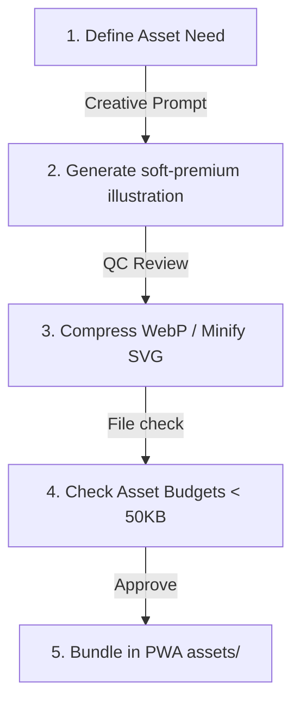
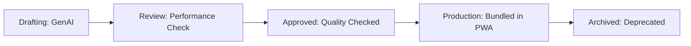

# Vastu Griha — Asset Pipeline Specification v1.0

**Status**: Approved / Engineering & Design System Spec  
**Version**: 1.0  
**Authors**: Principal Creative Director, Lead Frontend Performance Engineer  

---

## 1. Asset Philosophy

Visual assets in Vastu Griha must adhere to three core pillars:
1. **Performance-First**: The application is an installable PWA designed for mobile networks. Total initial load size of assets must remain under **1.5MB**. All imagery must load via optimized formats (WebP/SVG) with lazy loading enabled.
2. **Mobile-First**: Vectors and symbols must render cleanly on low-resolution mobile viewports without details washing out.
3. **Consistency-First**: All illustrations and icons must speak the same visual language: **Soft Premium 3D** (pastel colors, rounded corners, warm, studio-lighting feel) to convey a premium, trustworthy Vedic atmosphere.



---

## 2. Folder Structure

All application assets are located in `apps/vastu-griha/docs/assets/`. The folder structure is laid out as follows:

```
docs/assets/
├── icons/             # Custom inline SVG icons
├── illustrations/     # Pastel vectors for onboarding screens
├── products/          # Vedic remedies shop images
├── rooms/             # Placed room templates symbols
├── objects/           # Internal furniture assets
├── backgrounds/       # Sunrise and landscape gradients
├── patterns/          # Visual grids, Vastu mandalas
├── textures/          # Floor tile and backdrop layers
├── avatars/           # Collaborator initial avatars
├── acharya/           # Vastu guru chat illustrations
├── loading/           # AI scan loaders & progress animations
├── animations/        # Lottie JSON config files
├── logos/             # Brand identity icons
├── wireframes/        # Flow layouts
├── diagrams/          # Architecture, Database diagrams
└── references/        # User feedback recordings
```

---

## 3. Naming Convention

To ensure that assets are instantly searchable across our codebase, the project uses a strict namespace convention:

`[category]_[subcategory]_[description]_[version].[extension]`

### Naming Namespace Rules
* **Lowercase Only**: Characters must be lowercase; spaces are replaced with underscores (`_`).
* **Category Prefix**: Must start with a category descriptor from the table below:

| Category Prefix | Usage | Code Example |
| :--- | :--- | :--- |
| `icon_` | Inline SVG UI icons | `icon_chevron_right_v1.svg` |
| `illus_` | Onboarding/Welcome illustrations | `illus_hero_villa_v1.webp` |
| `product_` | Remedies shop item photos | `product_copper_wire_50m_v1.webp` |
| `room_` | Placed room templates | `room_bedroom_master_v1.svg` |
| `anim_` | Lottie/GIF loop animations | `anim_ai_scanning_v1.json` |

---

## 4. Image Formats

| Format | Allowed Usage | Prohibited Usage | Target Bitrate / Quality |
| :--- | :--- | :--- | :--- |
| **SVG** | Vector icons, room templates, brand logos, grid overlays. | Do not use for product photos or complex gradients. | XML minified via SVGO. |
| **WebP** | Onboarding illustrations, remedies product images, user avatars. | Do not use for crisp text-only logos. | Quality 80% lossy. |
| **Lottie (JSON)**| UI loop animations, scanner paths, score check success loops. | Do not use for background screens. | Under 100KB payload. |
| **JPEG / PNG** | Standard fallback options when WebP is unsupported. | Do not use as primary format. | Quality 70% compressed. |

---

## 5. Illustration Library

Every illustration category in Vastu Griha must align with the **Soft Premium 3D** design system:

| Illustration Category | Core Purpose | Midjourney Prompt Style | camera / Lighting |
| :--- | :--- | :--- | :--- |
| **`illus_home`** | Dashboard Greeting | *"Modern double-story luxury villa, white facade, flat roof, sunset gradient sky, soft clay texture"* | Isometric, Studio light |
| **`illus_upload`** | Backdrop blueprint uploader | *"Folded paper sheet blueprint, purple upload badge overlay, pastel background"* | Orthographic, Warm light |
| **`illus_ai`** | AI wizard steps | *"Friendly robot head, round features, copper metallic eyes, glowing aura"* | Front-facing, Studio light |
| **`illus_audit`** | Visual checklist reviews | *"Gold magnifying lens focusing on a miniature clay house, green checkmarks"* | Close-up, Soft shadows |
| **`illus_shop`** | Remedies shop tab | *"Clay treasure chest open, glowing gold light, copper wires and crystals inside"* | High angle, Warm light |

---

## 6. Icon Library

* **Format**: XML-minified inline SVGs only.
* **Vector Constraints**: Stroke weight `2px`, corner radius `6px` on borders, centered viewbox bounds `0 0 24 24`.
* **Standard Dimensions**:
  * Navigation Bar: `22px x 22px`
  * Action Buttons: `16px x 16px`
  * Badges / Tags: `12px x 12px`

---

## 7. Room Objects

Standard room blocks mapped to coordinate percentages inside the canvas engine:

```
[ Master Bedroom ] -> (SW) - size: 30x25% - Nairutya (Earth)
[ Kids Bedroom ]   -> (NW) - size: 25x25% - Vayu (Wind)
[ Parents Bedroom] -> (NE) - size: 25x25% - Ishanya (Water)
[ Kitchen Cook ]   -> (SE) - size: 22x22% - Agni (Fire)
```

### Room Parameters Table

| Room ID | Catalog Type | Label | Default Dimensions | Default Zone |
| :--- | :--- | :--- | :--- | :--- |
| `bedroom_master` | Private | Master Bedroom | 30 x 25 ft | South-West (SW) |
| `bedroom_kids` | Private | Kids Bedroom | 25 x 25 ft | North-West (NW) |
| `kitchen_cook` | Utility | Kitchen Cooktop | 22 x 22 ft | South-East (SE) |
| `pooja_mandir` | Vedic | Pooja Temple | 15 x 15 ft | North-East (NE) |
| `staircase_block`| Vedic | Staircase | 15 x 25 ft | South (S) / West (W) |
| `toilet_bath` | Utility | Bathroom / Toilet | 18 x 15 ft | West (W) / North-West (NW) |

---

## 8. Product Images

Remedy products listed in the Shop must follow these guidelines:
* **Background**: Solid color matching the card surface background (`#1C1D20`) or transparent background with a soft drop shadow.
* **Angles**: Standard 3/4 perspective view showing product width, height, and depth.
* **Resolution**: Locked to `400px x 400px` WebP, compressed to quality level `75%` to keep page loads under 25KB per product.

---

## 9. Animation Library

Animations are used to provide feedback during layout audits:

1. **AI Thinking (`anim_thinking.json`)**: 3 pulsing dots to indicate background evaluation processes.
2. **AI Scanning (`anim_scanning.json`)**: A glowing horizontal bar that moves up and down the canvas.
3. **Success Score Check (`anim_success.json`)**: A circular checkmark animation that plays when layout edits improve the Vastu score.

---

## 10. Image Generation Standards

All visual assets must conform to these standard parameters:
* **Soft Premium 3D Style**: Clean, rounded clay renders with pastel gradients.
* **Lighting Style**: Soft studio lighting with warm, diffused shadows.
* **Composition**: Center-aligned on transparent background.
* **Zero Watermarks**: Watermarks, text labels, or geometric line numbers are strictly prohibited.

---

## 11. Prompt Library Structure

Prompts are organized inside the `docs/assets/prompts/` directory:

```
prompts/
├── Image_Generation/   # Midjourney/DALL-E prompts for illustration mockups
├── Claude/             # Prompts to configure Vastu Acharya chat personas
└── Antigravity/        # Engineering workflow automation scripts
```

---

## 12. Optimization

All assets must be minified and optimized before being bundled into production builds:

* **SVG Minification**: Run through `svgo` with the command:  
  `svgo --config=svgo.config.js -f src/assets/icons/ -o dist/assets/icons/`
* **WebP Compression**: Convert raw PNG/JPEG images via `cwebp` with a target quality of 80%:  
  `cwebp -q 80 input.png -o output.webp`
* **Asset Size Budgets**:
  * SVG Icon files: **< 3KB**
  * WebP Onboarding Illustrations: **< 60KB**
  * Lottie JSON animations: **< 80KB**

---

## 13. Versioning

* **v1 (Active)**: Standard asset variants used in current production builds.
* **v2 (Experimental)**: High-resolution testing assets for wider viewports.
* **Deprecated**: Moved to `docs/archive/deprecated/` once replaced by updated files.

---

## 14. Asset Approval Workflow

All visual assets must pass through this five-stage pipeline:



---

## 15. Future Pipeline

* **USDZ / GLB 3D Assets**: Preparing for AR features by creating 3D asset variants of room templates.
* **Vedic Soundscapes**: Adding soft, meditative audio clips to provide auditory feedback when the Vastu score increases.
