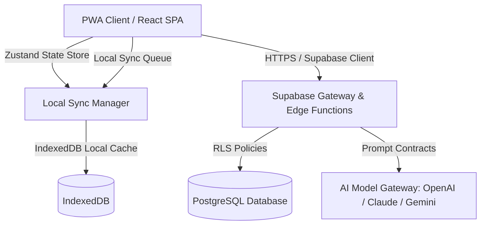
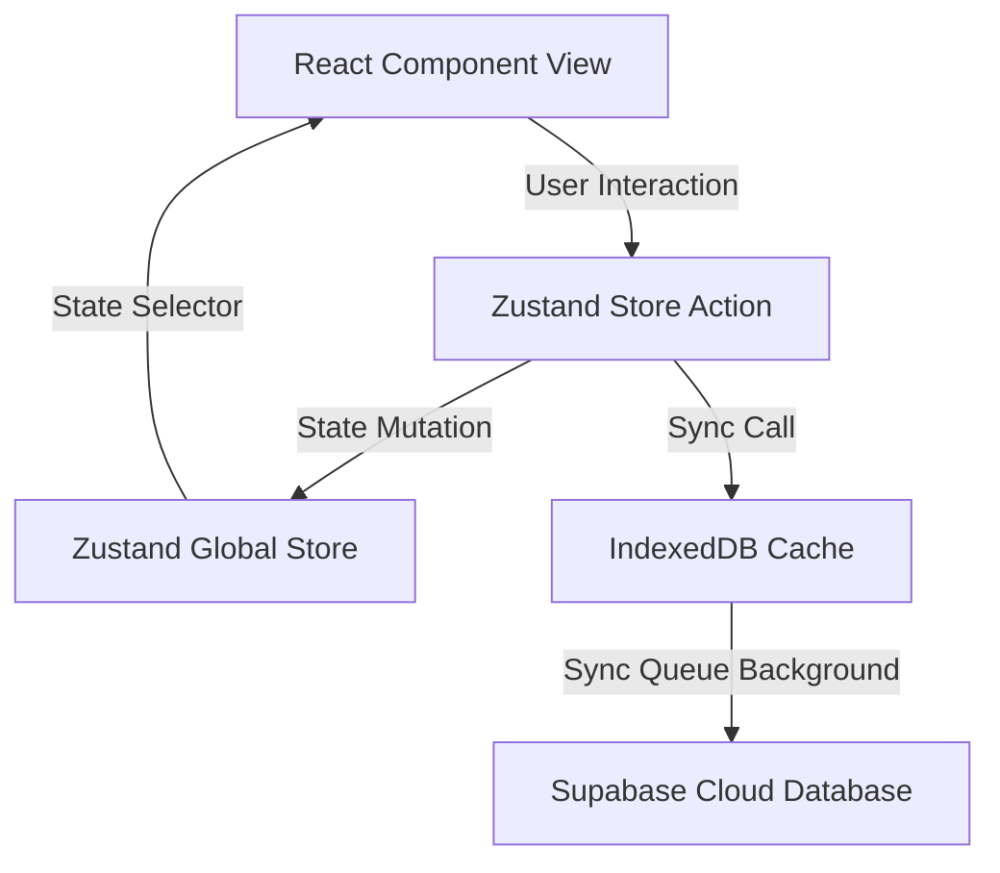
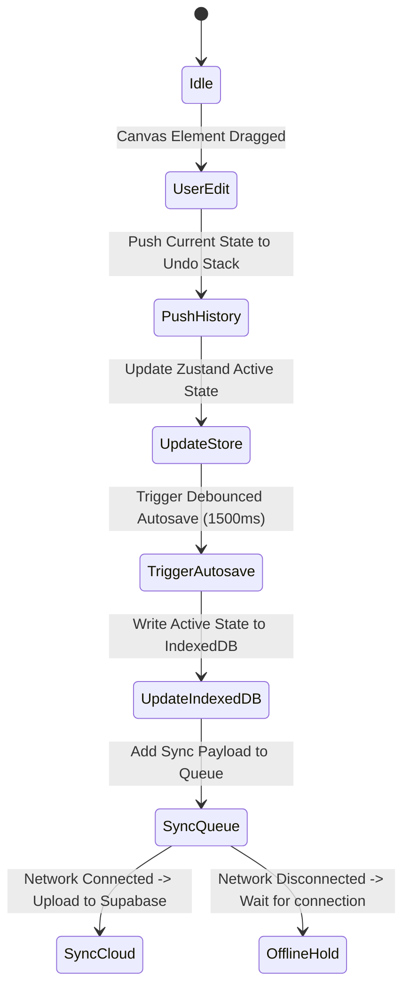
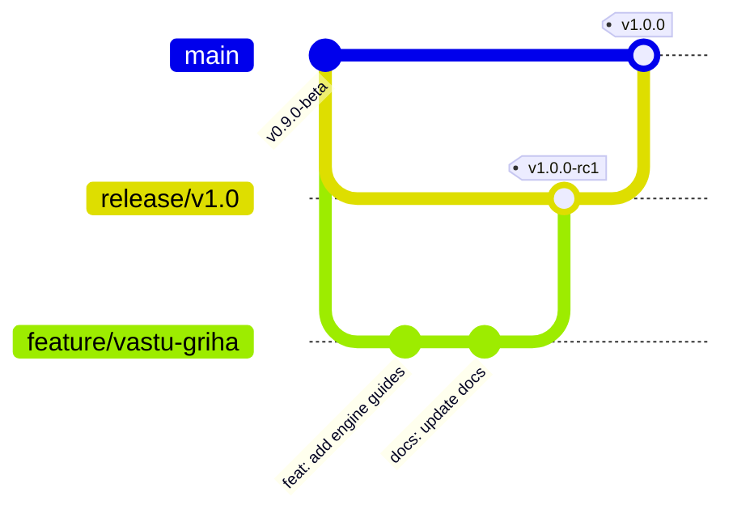

# Vastu Griha — Engineering Guidelines Specification v1.0

**Status**: Approved / Engineering Core Standard  
**Version**: 1.0  
**Authors**: Principal Architect, Director of Frontend Infrastructure  

---

## 1. Engineering Philosophy

The design, implementation, and deployment of Vastu Griha are governed by these fundamental engineering principles:

* **Mobile-First Engineering**: All interfaces must be designed for mobile screens and touch interactions first. Viewports must scale dynamically to fit budget devices. Heavy computation (like image scaling or geometric rendering calculations) should leverage web workers to prevent locking the main thread on low-spec mobile chips.
* **Performance-First Engineering**: Vastu Griha is designed for high accessibility, even on low-speed mobile networks. The initial application bundle must remain under **1.5MB**. All network resources must be aggressively cached, and all images must serve optimized formats (WebP/SVG).
* **AI-Assisted Development**: Coding agents and developers must respect system prompt specs and follow API constraints. Code is verified against the test suites and compliance logs before staging.
* **Simplicity Over Cleverness**: Code must be straightforward and maintainable. Avoid complex abstractions, deeply nested ternary statements, or convoluted functional patterns. If a junior developer cannot understand a file within 5 minutes, it must be refactored for clarity.
* **Readability Over Short Code**: Prefer descriptive naming patterns and explicit logical flows over dense inline shortcuts.
* **User Experience (UX) Before Developer Convenience**: Code constraints must never degrade user transitions. If a requirement is difficult to code but delivers a superior mobile UI experience, the engineering effort must accommodate the layout.
* **Never Break Existing User Projects**: Changes in database schemas, state structures, or components must guarantee backward compatibility. Users' saved blueprints and Vastu audit histories must import correctly across model updates.
* **Offline-First Architectural Flow**: The core planner and reporting components must fully function without a network connection. All data writes commit to local IndexedDB databases and queue for background cloud synchronization when connectivity returns.



---

## 2. Technology Stack

The official technology stack for Vastu Griha is locked to the following layers:

### Core Frameworks
* **Frontend**: React 18+ inside a Next.js / Vite Single Page Application framework.
* **State Management**: Zustand for global client stores and dynamic canvas models.
* **Styling**: Vanilla CSS utilizing design variables (`dist/variables.css`).
* **Database & Auth**: Supabase (Postgres) handling user authentication, storage buckets, and layout sync databases.
* **AI Integrations**: Structured JSON routing to OpenAI API (GPT-4o), Claude API (3.5 Sonnet), and Gemini API (1.5 Pro).
* **PWA Engine**: Service Worker caching, background sync APIs, and local IndexedDB database layers (via `idb` library).

### Testing & Infrastructure
* **Testing Library**: Vitest for unit tests, MSW for API mocking, and Playwright for E2E user interaction validation.
* **CI/CD Build Pipelines**: GitHub Actions testing, building, checking style rules, and deploying to Vercel/Supabase environments.
* **Analytics & Logging**: Winston log formatting locally, Sentry for error tracking, and custom edge triggers for AI audit logging.

---

## 3. Project Folder Structure

The project follows a standard module structure to isolate concerns:

```
apps/vastu-griha/
├── public/                 # Static assets (favicons, manifest.json)
├── src/
│   ├── assets/             # Brand logos, icons, patterns
│   ├── components/         # Shared UI components (Buttons, Inputs, Modals)
│   │   ├── forms/          # Form-specific elements
│   │   └── overlays/       # Tooltips, alerts, drop-down menus
│   ├── features/           # Feature modules
│   │   ├── audit/          # Vastu compliance audit rules
│   │   ├── canvas/         # 2D coordinate planner engine
│   │   ├── shop/           # Remedies shop catalog
│   │   └── chat/           # Acharya AI conversational chat
│   ├── hooks/              # Custom global React hooks
│   ├── lib/                # External client integrations (Supabase, OpenAI)
│   ├── services/           # Data services and API integration wrappers
│   ├── stores/             # Zustand state stores
│   │   ├── canvasStore.ts  # Active planner state
│   │   └── authStore.ts    # User login state
│   ├── types/              # TypeScript typings and interfaces
│   └── utils/              # Pure utility functions (conversions, math)
├── tests/                  # Test suites
│   ├── e2e/                # Playwright regression scripts
│   └── mocks/              # Mock API responses
└── docs/                   # System design specifications
```

### Folder Responsibilities

| Directory | Core Operational Responsibility | Constraint |
| :--- | :--- | :--- |
| `src/components/` | Reusable UI buttons, fields, modal containers. | No business logic. |
| `src/features/` | Feature specific files containing components, hooks, and services. | Self-contained, import only via index. |
| `src/stores/` | Zustand state objects for canvas layout and auth persistence. | Must sync changes to IndexedDB. |
| `src/utils/` | Deterministic mathematical scripts (e.g. geometric checks). | Must contain unit test validations. |
| `src/lib/` | Instantiated API gateways and database configurations. | Secrets must load from env files. |

---

## 4. Coding Standards

Every code file must adhere to these coding standards:

### Naming Conventions
* **File Names**:
  * React Components: PascalCase (`CanvasGrid.tsx`).
  * Hooks: camelCase starting with `use` (`useCanvasState.ts`).
  * Utilities and Scripts: kebab-case (`coordinate-math.ts`).
* **Variable & Function Names**: camelCase naming (`activeRoomId`, `calculateVastuScore`).
* **Constants & Enums**: UPPERCASE with underscore separators (`DEFAULT_GRID_SIZE`, `CompassDirection.NORTH`).
* **Types & Interfaces**: PascalCase (`VastuZone`, `RoomCoordinates`).

### TypeScript Requirements
* Avoid using the `any` type. If a type is complex, define a strict type constraint or utilize generic descriptors (`T`).
* All API response models, database rows, and canvas components must declare matching interfaces inside `src/types/`.

### Comments & Documentation
* Document hooks and math utilities using JSDoc formatting.
* Add clarifying inline comments for complex mathematical algorithms (e.g., polygon intersection formulas).
* Avoid comments that state what the code does; explain *why* it does it.

---

## 5. React Standards

### Component Guidelines
* Use functional components with hooks. Class components are prohibited.
* Enforce **Composition over Inheritance**. Build layouts using parent-child wrappers rather than configuration matrices.
* Components must remain focused and handle a single responsibility. If a component exceeds 250 lines, split it into smaller sub-components.

### State Isolation
* Keep state local unless shared across unrelated features.
* Avoid prop drilling beyond three component layers. If state is required deeper in the tree, use React Context or a Zustand state store.

### Performance & Memoization
* Memoize heavy calculation variables using `useMemo`.
* Wrap callback functions passed to children in `useCallback` to prevent unnecessary render cycles.
* Implement window virtualization for long product and audit list scroll viewports.

---

## 6. State Management

The application state is split into three layers: local, global, and persistent.



### Zustand Store Actions
* All state updates must occur through explicit actions defined within the Zustand store. Direct state mutations from components are prohibited.
* Selectors must be used to retrieve slices of state, preventing unnecessary renders across unrelated layout changes.

### Undo/Redo & History Stack
* The canvas store maintains a historical changes stack to support undo and redo operations.
* **Maximum History Limit**: 50 states. Older state commits are dropped from memory.

### Autosave & Synced Offline Actions
* Autosave operates on a **1500ms debounce** from the last layout modification action.
* Sync operations run asynchronously. If offline, changes are written to the local IndexedDB sync queue.



---

## 7. API Standards

Every API endpoint must follow a standardized format.

### Request/Response Payload
* The endpoint path must start with `/api/v1/`.
* Responses must return a JSON payload with standard properties:

```json
{
  "success": true,
  "data": {
    "audit_id": "aud_01H7Y898A1901BA8B",
    "vastu_score": 85
  },
  "error": null
}
```

* Errors must return an error details object:

```json
{
  "success": false,
  "data": null,
  "error": {
    "code": "INSUFFICIENT_DIMENSIONS",
    "message": "The floor plan lacks sufficient readable dimensions.",
    "details": ["Room Bed-1 missing width values."]
  }
}
```

### Network Safeguards
* **Timeout Limit**: 15 seconds. If the API does not respond within this limit, the request aborts and switches to fallback logic.
* **Exponential Backoff**: Failed requests are retried up to 3 times, with delays of 1s, 2s, and 4s respectively.

---

## 8. Database Guidelines

Database tables and relationships are managed via migrations.

### Schema Conventions
* **Table Names**: Lowercase, plural, snake_case (e.g., `audit_results`, `saved_projects`).
* **IDs**: UUID (v4) serves as the primary key.
* **Foreign Keys**: Must enforce constraints, defining the cascading behavior on delete (`ON DELETE CASCADE`).
* **Audit Columns**: Every table must record creation and modification times: `created_at` and `updated_at`.

### Row Level Security (RLS)
* Direct public reads or writes are blocked.
* Every query table must configure RLS rules matching user UUID tokens:

```sql
ALTER TABLE saved_projects ENABLE ROW LEVEL SECURITY;

CREATE POLICY "Users can manage their own projects"
  ON saved_projects
  FOR ALL
  USING (auth.uid() = user_id);
```

---

## 9. AI Integration Standards

AI processing must follow prompt contracts to ensure consistent responses.

* **Prompt Contracts**: Prompt files must have version headers specifying the model, temperature, max tokens, and JSON validation schemas (as detailed in the `AI Prompt Library`).
* **Token Caching & Optimization**: Dynamic context payloads must group unchanged segments first to leverage input token caching.
* **Fallbacks**: If a call to OpenAI fails, the system routes the request to Claude. If all cloud models fail, the app runs local Javascript rules.

---

## 10. Performance Standards

To deliver a fast loading experience on mobile devices, build outputs must fit inside these budget limits:

| Asset Type | Maximum Limit | Target Budget | Compression Standard |
| :--- | :--- | :--- | :--- |
| **Initial HTML/JS bundle** | < 1.5 MB | < 800 KB | Gzipped / Brotli compressed |
| **Vendor JS Chunks** | < 250 KB | < 150 KB | Split-chunking enabled |
| **Global Styling CSS** | < 50 KB | < 30 KB | Minified stylesheet |
| **System Icons (SVG)** | < 3 KB | < 1.5 KB | SVGO XML clean |
| **Product Remedies Images** | < 25 KB | < 15 KB | WebP at 75% quality |
| **Lottie UI Animations** | < 80 KB | < 45 KB | Compressed JSON files |

### Code Splitting & Optimization
* Lazy-load non-critical routes (like the Shop tab and Chat sub-screens) using React Dynamic Imports.
* Tree-shake unused packages (like Lodash or custom icons).

---

## 11. Offline Strategy

Vastu Griha is designed to operate without a reliable network connection.

### Service Worker Caching
* Assets (index.html, JS chunks, SVG icons, fonts) are cached locally inside the user's browser using Cache API storage.
* Network-first fallback to cache strategy is used for data API calls.

### Offline Sync Queue
* Writes to the cloud are processed through a local sync queue in IndexedDB.
* When offline, write events are appended to the queue, and the UI displays a warning banner.
* Once connection is restored, the queue uploads pending items sequentially.

---

## 12. Security Standards

* **Data Encryption**: Saved layout coordinates and custom audit files are encrypted in the local cache using AES-256 with user-specific keys.
* **Sanitization**: User-generated room labels, text strings, and chat inputs are cleaned via DOMPurify before rendering to prevent cross-site scripting (XSS).
* **AI Security**: Clean inputs before sending to LLM APIs. Remove names, phone numbers, and addresses from drawings to protect user privacy.

---

## 13. Accessibility Standards

Vastu Griha follows WCAG 2.1 AA design standards:

* **Keyboard Navigation**: The floor plan editor must support keyboard shortcuts (arrow keys to move selected items, backspace to delete). Tab order must be logical.
* **Aria Descriptions**: Custom canvas elements must include screen-reader friendly tags:

```tsx
<div 
  role="application"
  aria-label="Interactive Vastu Floor Plan Canvas"
  aria-describedby="canvas_instructions"
/>
```

* **Visual Accessibility**: Touch targets must be at least **44px x 44px**. Minimum text contrast ratio must be **4.5:1** for regular text.

---

## 14. Logging & Monitoring

* **Application Logs**: Client-side logs are grouped using Winston logger levels: `error`, `warn`, `info`, and `debug`.
* **Error Tracking**: Unhandled exceptions and UI crashes are caught by Error Boundaries and logged to Sentry.
* **Performance Metrics**: Key user events (FCP, LCP, CLS, time-to-render audits) are tracked and monitored via Supabase logs.

---

## 15. Git Workflow

We use a structured branching and versioning system to organize code changes:



### Branch Naming Patterns
* Feature development: `feature/[ticket-id]-short-description`
* Bug fixes: `bugfix/[ticket-id]-fix-issue`
* Production hotfixes: `hotfix/[ticket-id]-critical-fix`

### Commit Message Conventions
Commits must use semantic prefixes:
* `feat:` (new feature)
* `fix:` (bug fix)
* `docs:` (documentation changes)
* `perf:` (performance optimization)
* `test:` (testing additions)

*Example*: `feat(canvas): implement multi-node snap rules to alignment grid`

---

## 16. Testing Standards

* **Unit Testing**: Math functions, Vastu calculation rules, and Zustand actions must be verified by Vitest unit tests, aiming for at least **85% code coverage**.
* **API Mocking**: Mock Service Worker (MSW) intercepts all test network calls to ensure offline testing consistency.
* **E2E Testing**: Playwright runs automated test suites for user log-ins, floor plan uploads, room layout modifications, and PDF exports.

---

## 17. Code Review Checklist

Reviewers must verify that pull requests meet these criteria before approval:

* **Performance**: Bundle size footprint check, loop iterations validation.
* **Security**: Proper authorization checks, sanitized strings.
* **Accessibility**: Proper ARIA labeling, keyboard navigation checks.
* **UI Consistency**: Styles must rely on CSS variables, layout matches responsive rules.
* **Code Reuse**: Hooks reuse validation, avoiding duplicate components.
* **Error Handling**: Missing API fallbacks and error boundaries validation.
* **Offline Testing**: App performance checks in simulated offline mode.

---

## 18. Definition of Done (DoD)

A development ticket is complete only when all the following items are verified:

1. [ ] **Code Implementation**: All functional requirements are implemented and linting issues resolved.
2. [ ] **Testing**: Automated unit and integration tests pass with required coverage.
3. [ ] **Documentation**: Prompt libraries, component specs, and API guides are updated.
4. [ ] **Analytics**: Key user events and audit triggers are logged.
5. [ ] **Accessibility**: Component passes WCAG 2.1 AA keyboard and screen reader checks.
6. [ ] **Performance**: Page speed, chunk size budgets, and render limits are verified.
7. [ ] **Error Handling**: Empty UI states, loading skeletons, and API timeout fallbacks are implemented.
8. [ ] **Offline Verification**: Feature is validated in offline mode with IndexedDB data syncing.
9. [ ] **Product Owner Sign-off**: Visual layouts and compliance outputs are approved by the PO.

---

## 19. AI Coding Rules

AI coding agents (such as Antigravity) must follow these strict operational rules:

1. **Never Invent APIs**: Utilize only verified packages listed in `package.json`.
2. **Never Duplicate Components**: Before creating a UI helper, check `src/components/` and reuse existing templates.
3. **No Direct State Manipulation**: Modify global stores only through predefined actions.
4. **Never Modify Locked Specifications**: Documentation marked as version locked (e.g. `MASTER_ROADMAP.md`) must not be updated without user authorization.
5. **Always Update Documentation**: If an engineering change alters routes, structures, or state formats, update the corresponding markdown specification files immediately.

---

## 20. Future Engineering Roadmap

* **Plugin Architecture**: Creating developer hooks to let external Vastu experts add custom rule sets or spatial analytics models.
* **Micro-Frontends**: Decoupling the Shop catalog and Vastu Acharya chat engine into separate lazy-loaded web apps to simplify builds.
* **Desktop App Wrapper**: Packing Vastu Griha via Electron/Tauri wrapper frameworks to support offline layout planning on desktop viewports.
* **AR Integration**: Building custom WebXR overlays to map visual Vastu purusha mandalas directly onto real room viewports.
