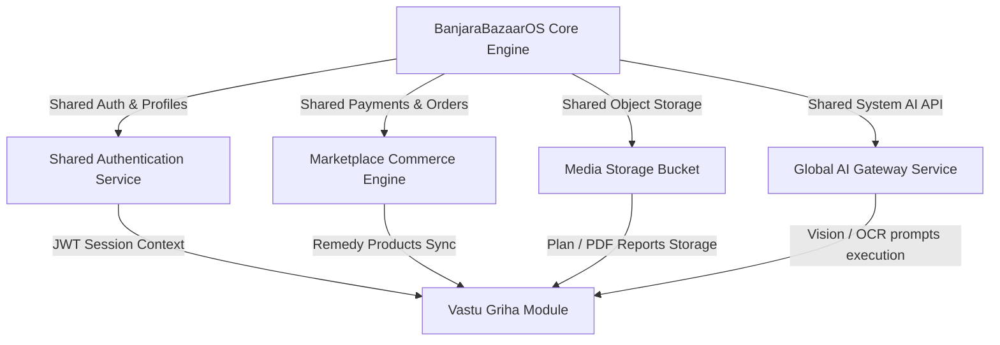
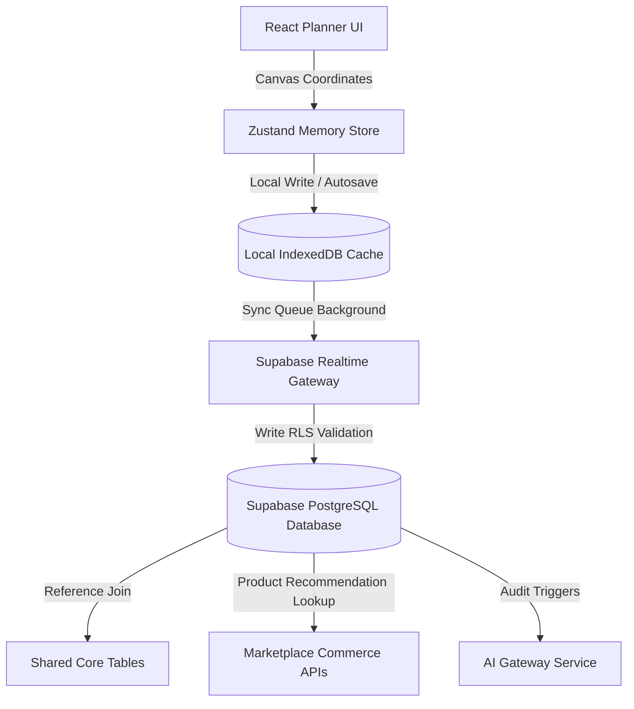
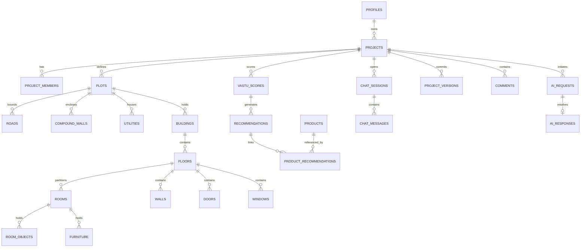
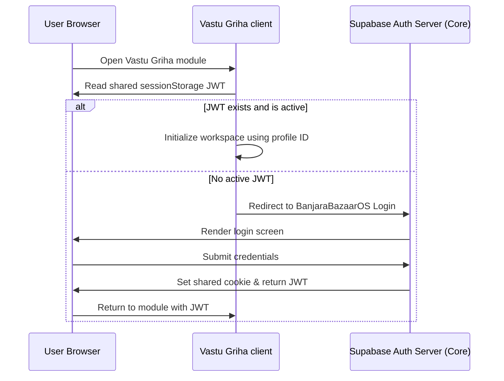
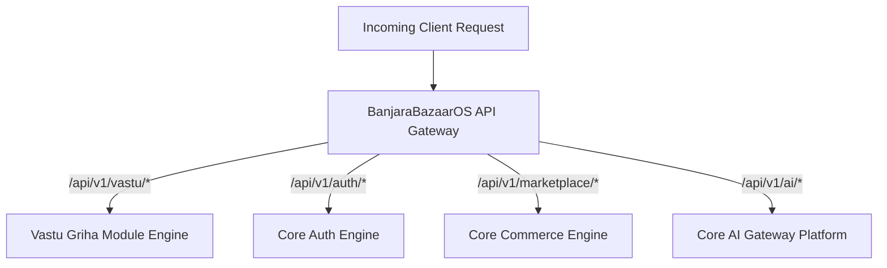
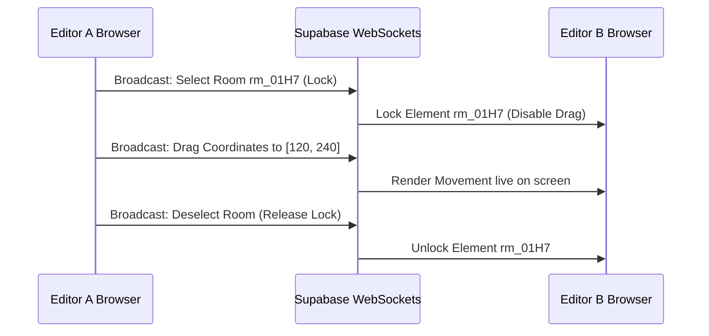
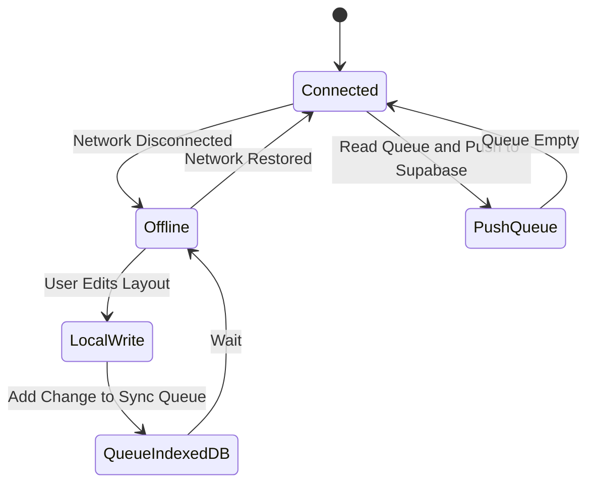

# Vastu Griha — Database & API Specification v1.0

**Status**: Release Candidate / Production Architecture Spec  
**Version**: 1.0  
**Authors**: Principal Platform Architect, Director of Databases & Integrations  

---

## 1. Platform Architecture

Vastu Griha is not a standalone application. It is engineered as a module that plugs directly into the **BanjaraBazaarOS** platform. Rather than duplicate core features like user accounts, payments, files, and notification systems, the Vastu Griha module extends core services and reads shared references.



---

## 2. Module Boundaries

To ensure clean segregation, data tables and functionalities are clearly partitioned between the BanjaraBazaarOS Core and the Vastu Griha Module.

### Ownership Boundary Matrix

| System Domain | Core Platform Controls (`[CORE PLATFORM]`) | Vastu Griha Module Controls (`[VASTU GRIHA MODULE]`) |
| :--- | :--- | :--- |
| **Identity & Access** | SSO Authentication, User Profiles, User Roles, RBAC permissions list. | Project-specific member roles (Owner, Editor, Consultant, Viewer). |
| **Commerce** | Remedy Products inventory, catalog categories, payment gateway, vendor contracts, order fulfillment. | Local recommendations matching Vastu score violations to remedy products. |
| **Files & Storage** | Root S3 storage buckets, bucket encryption, access key security. | Floor plan images, generated CAD vectors, printable PDF audit reports. |
| **AI Processing** | Global AI API key security, prompt logging, rate limits, model fallback execution. | Vastu prompt versions, localized spatial geometry context. |
| **Realtime** | WebSocket server sockets, presence channel state. | Canvas layout coordinate updates, live user cursor positions. |

---

## 3. High-Level Database Architecture

The local state syncing and remote database replication follows a tiered synchronization pipeline:



---

## 4. Entity Relationship Diagram (ERD)

This entity relationship diagram shows how the Vastu Griha Module tables branch off the shared BanjaraBazaarOS core tables.



---

## 5. Shared Core Tables (Reference Only)

The following tables are owned and maintained by the **BanjaraBazaarOS Core**. The Vastu Griha module accesses them read-only for authentication, marketplace integration, and telemetry.

### 1. `profiles` `[CORE PLATFORM]`
* **Purpose**: Base profile information for platform users.
* **Schema Reference**:
  * `id` (`uuid`, Primary Key)
  * `email` (`varchar`, Unique)
  * `full_name` (`varchar`)
  * `avatar_url` (`varchar`)
  * `created_at` (`timestamp`)

### 2. `products` `[CORE PLATFORM]`
* **Purpose**: Unified platform remedies e.g., copper wire, brass helix.
* **Schema Reference**:
  * `id` (`uuid`, Primary Key)
  * `sku` (`varchar`, Unique)
  * `title` (`varchar`)
  * `description` (`text`)
  * `price_cents` (`integer`)
  * `image_url` (`varchar`)
  * `inventory_count` (`integer`)

### 3. `orders` `[CORE PLATFORM]`
* **Purpose**: Tracks platform checkout items.
* **Schema Reference**:
  * `id` (`uuid`, Primary Key)
  * `user_id` (`uuid`, FK references `profiles.id`)
  * `total_cents` (`integer`)
  * `status` (`varchar`)

### 4. `media` `[CORE PLATFORM]`
* **Purpose**: General metadata catalog for media assets.
* **Schema Reference**:
  * `id` (`uuid`, Primary Key)
  * `bucket_name` (`varchar`)
  * `file_path` (`varchar`)
  * `owner_id` (`uuid`, FK references `profiles.id`)

---

## 6. Vastu Griha Tables

The following tables are owned entirely by the **Vastu Griha Module** (`[VASTU GRIHA MODULE]`).

### 1. `projects`
* **Purpose**: Primary configuration entries for layouts.
* **Columns**:
  * `id` (`uuid`, Primary Key, default `gen_random_uuid()`)
  * `owner_id` (`uuid`, FK references `profiles.id` on delete restrict)
  * `name` (`varchar`, Not Null)
  * `created_at` (`timestamp with time zone`, default `now()`)
  * `updated_at` (`timestamp with time zone`, default `now()`)
  * `deleted_at` (`timestamp with time zone`, Nullable)
* **Indexes**: Index on `owner_id`, index on `deleted_at` (filter active).

### 2. `project_members`
* **Purpose**: Map users to shared canvas project teams.
* **Columns**:
  * `project_id` (`uuid`, FK references `projects.id` on delete cascade, Part of PK)
  * `profile_id` (`uuid`, FK references `profiles.id` on delete cascade, Part of PK)
  * `role` (`varchar`, Not Null, Constraint: `role IN ('owner', 'editor', 'consultant', 'viewer')`)
  * `joined_at` (`timestamp with time zone`, default `now()`)
* **Indexes**: Composite PK (`project_id`, `profile_id`), index on `profile_id`.

### 3. `plots`
* **Purpose**: Defines property dimensions and basic magnetic alignments.
* **Columns**:
  * `id` (`uuid`, Primary Key, default `gen_random_uuid()`)
  * `project_id` (`uuid`, FK references `projects.id` on delete cascade, Unique)
  * `width_ft` (`numeric(6,2)`, Not Null)
  * `length_ft` (`numeric(6,2)`, Not Null)
  * `orientation_offset_deg` (`numeric(5,2)`, default `0.00`, Constraint: `offset between -180 and 180`)
  * `created_at` (`timestamp with time zone`, default `now()`)
* **Indexes**: Index on `project_id`.

### 4. `plot_boundaries`
* **Purpose**: Stores list of coordinates defining irregular shapes.
* **Columns**:
  * `plot_id` (`uuid`, FK references `plots.id` on delete cascade, Part of PK)
  * `sequence_num` (`integer`, Part of PK)
  * `relative_x` (`numeric(6,2)`, Not Null)
  * `relative_y` (`numeric(6,2)`, Not Null)
* **Indexes**: Composite PK (`plot_id`, `sequence_num`).

### 5. `roads`
* **Purpose**: Outer roads context for Vastu approach evaluations.
* **Columns**:
  * `id` (`uuid`, Primary Key, default `gen_random_uuid()`)
  * `plot_id` (`uuid`, FK references `plots.id` on delete cascade)
  * `side` (`varchar`, Not Null, Constraint: `side IN ('north', 'south', 'east', 'west', 'northeast', 'northwest', 'southeast', 'southwest')`)
  * `width_ft` (`numeric(5,2)`, default `20.00`)
* **Indexes**: Index on `plot_id`.

### 6. `compound_walls`
* **Purpose**: Compares compound walls for size metrics.
* **Columns**:
  * `plot_id` (`uuid`, FK references `plots.id` on delete cascade, Part of PK)
  * `side` (`varchar`, Part of PK, Constraint: `side IN ('north', 'south', 'east', 'west')`)
  * `thickness_in` (`numeric(4,2)`, default `9.00`)
  * `height_ft` (`numeric(4,2)`, default `6.00`)
* **Indexes**: Composite PK (`plot_id`, `side`).

### 7. `gates`
* **Purpose**: Placement coordinates of compound gates.
* **Columns**:
  * `id` (`uuid`, Primary Key, default `gen_random_uuid()`)
  * `plot_id` (`uuid`, FK references `plots.id` on delete cascade)
  * `relative_x` (`numeric(6,2)`, Not Null)
  * `relative_y` (`numeric(6,2)`, Not Null)
  * `width_ft` (`numeric(4,2)`, default `10.00`)
* **Indexes**: Index on `plot_id`.

### 8. `utilities`
* **Purpose**: Tracks utilities placement (borewells, septic tanks).
* **Columns**:
  * `id` (`uuid`, Primary Key, default `gen_random_uuid()`)
  * `plot_id` (`uuid`, FK references `plots.id` on delete cascade)
  * `type` (`varchar`, Not Null, Constraint: `type IN ('borewell', 'water_tank_underground', 'water_tank_overhead', 'septic_tank', 'solar_array', 'ev_charger')`)
  * `relative_x` (`numeric(6,2)`, Not Null)
  * `relative_y` (`numeric(6,2)`, Not Null)
* **Indexes**: Index on `plot_id`, index on `type`.

### 9. `buildings`
* **Purpose**: Primary house structures.
* **Columns**:
  * `id` (`uuid`, Primary Key, default `gen_random_uuid()`)
  * `plot_id` (`uuid`, FK references `plots.id` on delete cascade)
  * `relative_x` (`numeric(6,2)`, Not Null)
  * `relative_y` (`numeric(6,2)`, Not Null)
  * `width_ft` (`numeric(6,2)`, Not Null)
  * `length_ft` (`numeric(6,2)`, Not Null)
* **Indexes**: Index on `plot_id`.

### 10. `floors`
* **Purpose**: Maps building floors.
* **Columns**:
  * `id` (`uuid`, Primary Key, default `gen_random_uuid()`)
  * `building_id` (`uuid`, FK references `buildings.id` on delete cascade)
  * `floor_num` (`integer`, Not Null, default `0`)
  * `label` (`varchar`, default `'Ground Floor'`)
* **Indexes**: Unique Composite index (`building_id`, `floor_num`).

### 11. `rooms`
* **Purpose**: Bounding box room nodes.
* **Columns**:
  * `id` (`uuid`, Primary Key, default `gen_random_uuid()`)
  * `floor_id` (`uuid`, FK references `floors.id` on delete cascade)
  * `type` (`varchar`, Not Null, Constraint: `type IN ('bedroom_master', 'bedroom_kids', 'kitchen_cook', 'pooja_mandir', 'toilet_bath', 'living_room', 'dining_room', 'balcony', 'staircase')`)
  * `relative_xmin` (`numeric(6,2)`, Not Null)
  * `relative_ymin` (`numeric(6,2)`, Not Null)
  * `relative_xmax` (`numeric(6,2)`, Not Null)
  * `relative_ymax` (`numeric(6,2)`, Not Null)
* **Indexes**: Index on `floor_id`, index on `type`.

### 12. `walls`
* **Purpose**: Wall objects grouping segments.
* **Columns**:
  * `id` (`uuid`, Primary Key, default `gen_random_uuid()`)
  * `floor_id` (`uuid`, FK references `floors.id` on delete cascade)
  * `thickness_in` (`numeric(4,2)`, default `9.00`)
  * `type` (`varchar`, default `'load_bearing'`)
* **Indexes**: Index on `floor_id`.

### 13. `wall_segments`
* **Purpose**: Precise layout lines.
* **Columns**:
  * `id` (`uuid`, Primary Key, default `gen_random_uuid()`)
  * `wall_id` (`uuid`, FK references `walls.id` on delete cascade)
  * `start_x` (`numeric(6,2)`, Not Null)
  * `start_y` (`numeric(6,2)`, Not Null)
  * `end_x` (`numeric(6,2)`, Not Null)
  * `end_y` (`numeric(6,2)`, Not Null)
* **Indexes**: Index on `wall_id`.

### 14. `doors`
* **Purpose**: Doors mapping.
* **Columns**:
  * `id` (`uuid`, Primary Key, default `gen_random_uuid()`)
  * `floor_id` (`uuid`, FK references `floors.id` on delete cascade)
  * `relative_x` (`numeric(6,2)`, Not Null)
  * `relative_y` (`numeric(6,2)`, Not Null)
  * `rotation_degrees` (`numeric(5,2)`, default `0.00`)
  * `swing_type` (`varchar`, default `'single_swing'`)
* **Indexes**: Index on `floor_id`.

### 15. `windows`
* **Purpose**: Windows coordinates.
* **Columns**:
  * `id` (`uuid`, Primary Key, default `gen_random_uuid()`)
  * `floor_id` (`uuid`, FK references `floors.id` on delete cascade)
  * `relative_x1` (`numeric(6,2)`, Not Null)
  * `relative_y1` (`numeric(6,2)`, Not Null)
  * `relative_x2` (`numeric(6,2)`, Not Null)
  * `relative_y2` (`numeric(6,2)`, Not Null)
* **Indexes**: Index on `floor_id`.

### 16. `ventilators`
* **Purpose**: Air vents layout map.
* **Columns**:
  * `id` (`uuid`, Primary Key, default `gen_random_uuid()`)
  * `floor_id` (`uuid`, FK references `floors.id` on delete cascade)
  * `relative_x` (`numeric(6,2)`, Not Null)
  * `relative_y` (`numeric(6,2)`, Not Null)
* **Indexes**: Index on `floor_id`.

### 17. `columns`
* **Purpose**: Vertical columns.
* **Columns**:
  * `id` (`uuid`, Primary Key, default `gen_random_uuid()`)
  * `floor_id` (`uuid`, FK references `floors.id` on delete cascade)
  * `relative_x` (`numeric(6,2)`, Not Null)
  * `relative_y` (`numeric(6,2)`, Not Null)
  * `width_ft` (`numeric(4,2)`, default `1.50`)
* **Indexes**: Index on `floor_id`.

### 18. `beams`
* **Purpose**: Structural horizontal beams.
* **Columns**:
  * `id` (`uuid`, Primary Key, default `gen_random_uuid()`)
  * `floor_id` (`uuid`, FK references `floors.id` on delete cascade)
  * `start_x` (`numeric(6,2)`, Not Null)
  * `start_y` (`numeric(6,2)`, Not Null)
  * `end_x` (`numeric(6,2)`, Not Null)
  * `end_y` (`numeric(6,2)`, Not Null)
* **Indexes**: Index on `floor_id`.

### 19. `stairs`
* **Purpose**: Staircases.
* **Columns**:
  * `id` (`uuid`, Primary Key, default `gen_random_uuid()`)
  * `floor_id` (`uuid`, FK references `floors.id` on delete cascade)
  * `relative_xmin` (`numeric(6,2)`, Not Null)
  * `relative_ymin` (`numeric(6,2)`, Not Null)
  * `relative_xmax` (`numeric(6,2)`, Not Null)
  * `relative_ymax` (`numeric(6,2)`, Not Null)
  * `climb_direction` (`varchar`, default `'clockwise'`)
* **Indexes**: Index on `floor_id`.

### 20. `balconies`
* **Purpose**: Balcony envelopes.
* **Columns**:
  * `id` (`uuid`, Primary Key, default `gen_random_uuid()`)
  * `floor_id` (`uuid`, FK references `floors.id` on delete cascade)
  * `relative_xmin` (`numeric(6,2)`, Not Null)
  * `relative_ymin` (`numeric(6,2)`, Not Null)
  * `relative_xmax` (`numeric(6,2)`, Not Null)
  * `relative_ymax` (`numeric(6,2)`, Not Null)
* **Indexes**: Index on `floor_id`.

### 21. `room_objects`
* **Purpose**: Room structural interior fixtures.
* **Columns**:
  * `id` (`uuid`, Primary Key, default `gen_random_uuid()`)
  * `room_id` (`uuid`, FK references `rooms.id` on delete cascade)
  * `type` (`varchar`, Not Null, Constraint: `type IN ('stove', 'kitchen_sink', 'wash_basin', 'toilet_commode', 'shower_area')`)
  * `relative_x` (`numeric(6,2)`, Not Null)
  * `relative_y` (`numeric(6,2)`, Not Null)
* **Indexes**: Index on `room_id`, index on `type`.

### 22. `furniture`
* **Purpose**: Placed furniture.
* **Columns**:
  * `id` (`uuid`, Primary Key, default `gen_random_uuid()`)
  * `room_id` (`uuid`, FK references `rooms.id` on delete cascade)
  * `type` (`varchar`, Not Null, Constraint: `type IN ('bed', 'sofa', 'dining_table', 'desk', 'wardrobe')`)
  * `relative_x` (`numeric(6,2)`, Not Null)
  * `relative_y` (`numeric(6,2)`, Not Null)
  * `rotation_degrees` (`numeric(5,2)`, default `0.00`)
* **Indexes**: Index on `room_id`.

### 23. `vastu_scores`
* **Purpose**: History of scoring events.
* **Columns**:
  * `id` (`uuid`, Primary Key, default `gen_random_uuid()`)
  * `project_id` (`uuid`, FK references `projects.id` on delete cascade)
  * `overall_score` (`integer`, Not Null)
  * `detail_scores_json` (`jsonb`, Not Null)
  * `created_at` (`timestamp with time zone`, default `now()`)
* **Indexes**: Index on `project_id`, index on `created_at`.

### 24. `audit_reports`
* **Purpose**: PDF downloads registry.
* **Columns**:
  * `id` (`uuid`, Primary Key, default `gen_random_uuid()`)
  * `project_id` (`uuid`, FK references `projects.id` on delete cascade)
  * `file_url` (`varchar`, Not Null)
  * `generated_at` (`timestamp with time zone`, default `now()`)
* **Indexes**: Index on `project_id`.

### 25. `audit_rules`
* **Purpose**: Master validation rules.
* **Columns**:
  * `id` (`uuid`, Primary Key, default `gen_random_uuid()`)
  * `code` (`varchar`, Unique, Not Null)
  * `category` (`varchar`, Not Null)
  * `description` (`text`, Not Null)
  * `weight` (`integer`, default `10`)
* **Indexes**: Index on `code`.

### 26. `recommendations`
* **Purpose**: Specific compliance corrections checklist.
* **Columns**:
  * `id` (`uuid`, Primary Key, default `gen_random_uuid()`)
  * `vastu_score_id` (`uuid`, FK references `vastu_scores.id` on delete cascade)
  * `rule_id` (`uuid`, FK references `audit_rules.id` on delete cascade)
  * `status` (`varchar`, default `'pending'`, Constraint: `status IN ('pending', 'resolved', 'ignored')`)
* **Indexes**: Index on `vastu_score_id`.

### 27. `product_recommendations`
* **Purpose**: Connects recommendations to Core products.
* **Columns**:
  * `recommendation_id` (`uuid`, FK references `recommendations.id` on delete cascade, Part of PK)
  * `product_id` (`uuid`, FK references `products.id` on delete restrict, Part of PK)
* **Indexes**: Composite PK (`recommendation_id`, `product_id`).

### 28. `placement_history`
* **Purpose**: Keeps changes track for layouts.
* **Columns**:
  * `id` (`uuid`, Primary Key, default `gen_random_uuid()`)
  * `project_id` (`uuid`, FK references `projects.id` on delete cascade)
  * `profile_id` (`uuid`, FK references `profiles.id` on delete restrict)
  * `action` (`varchar`, Not Null)
  * `state_snapshot` (`jsonb`, Not Null)
  * `created_at` (`timestamp with time zone`, default `now()`)
* **Indexes**: Index on `project_id`, index on `created_at`.

### 29. `chat_sessions`
* **Purpose**: Dialogue logs context for Vastu Acharya.
* **Columns**:
  * `id` (`uuid`, Primary Key, default `gen_random_uuid()`)
  * `project_id` (`uuid`, FK references `projects.id` on delete cascade)
  * `user_id` (`uuid`, FK references `profiles.id` on delete cascade)
  * `started_at` (`timestamp with time zone`, default `now()`)
* **Indexes**: Index on `project_id`, index on `user_id`.

### 30. `chat_messages`
* **Purpose**: Conversations history.
* **Columns**:
  * `id` (`uuid`, Primary Key, default `gen_random_uuid()`)
  * `session_id` (`uuid`, FK references `chat_sessions.id` on delete cascade)
  * `sender` (`varchar`, Not Null, Constraint: `sender IN ('user', 'acharya')`)
  * `message_text` (`text`, Not Null)
  * `created_at` (`timestamp with time zone`, default `now()`)
* **Indexes**: Index on `session_id`, index on `created_at`.

### 31. `ai_requests`
* **Purpose**: Audit prompt runs tracking.
* **Columns**:
  * `id` (`uuid`, Primary Key, default `gen_random_uuid()`)
  * `project_id` (`uuid`, FK references `projects.id` on delete cascade)
  * `prompt_id` (`varchar`, Not Null)
  * `request_payload` (`jsonb`, Not Null)
  * `created_at` (`timestamp with time zone`, default `now()`)
* **Indexes**: Index on `project_id`, index on `prompt_id`.

### 32. `ai_responses`
* **Purpose**: Metrics tracking for AI analysis outputs.
* **Columns**:
  * `id` (`uuid`, Primary Key, default `gen_random_uuid()`)
  * `request_id` (`uuid`, FK references `ai_requests.id` on delete cascade, Unique)
  * `response_payload` (`jsonb`, Not Null)
  * `latency_ms` (`integer`, Not Null)
  * `cost` (`numeric(8,5)`, default `0.00000`)
  * `confidence` (`numeric(3,2)`, Not Null)
  * `created_at` (`timestamp with time zone`, default `now()`)
* **Indexes**: Index on `request_id`.

### 33. `project_versions`
* **Purpose**: Stores committed layout configurations.
* **Columns**:
  * `id` (`uuid`, Primary Key, default `gen_random_uuid()`)
  * `project_id` (`uuid`, FK references `projects.id` on delete cascade)
  * `version_num` (`integer`, Not Null)
  * `commit_message` (`text`, default `'Manual snapshot'`)
  * `layout_snapshot` (`jsonb`, Not Null)
  * `created_at` (`timestamp with time zone`, default `now()`)
* **Indexes**: Unique index on (`project_id`, `version_num`).

### 34. `project_activity`
* **Purpose**: Audit log for client events.
* **Columns**:
  * `id` (`uuid`, Primary Key, default `gen_random_uuid()`)
  * `project_id` (`uuid`, FK references `projects.id` on delete cascade)
  * `actor_id` (`uuid`, FK references `profiles.id` on delete restrict)
  * `description` (`text`, Not Null)
  * `timestamp` (`timestamp with time zone`, default `now()`)
* **Indexes**: Index on `project_id`.

### 35. `shared_links`
* **Purpose**: Secure token authorization for layout sharing.
* **Columns**:
  * `id` (`uuid`, Primary Key, default `gen_random_uuid()`)
  * `project_id` (`uuid`, FK references `projects.id` on delete cascade)
  * `token` (`uuid`, Unique, default `gen_random_uuid()`)
  * `role_allowed` (`varchar`, default `'viewer'`, Constraint: `role_allowed IN ('editor', 'consultant', 'viewer')`)
  * `expires_at` (`timestamp with time zone`, Nullable)
* **Indexes**: Index on `token`.

### 36. `comments`
* **Purpose**: Collaboration pins.
* **Columns**:
  * `id` (`uuid`, Primary Key, default `gen_random_uuid()`)
  * `project_id` (`uuid`, FK references `projects.id` on delete cascade)
  * `actor_id` (`uuid`, FK references `profiles.id` on delete restrict)
  * `room_id` (`uuid`, FK references `rooms.id` on delete cascade, Nullable)
  * `comment_text` (`text`, Not Null)
  * `created_at` (`timestamp with time zone`, default `now()`)
* **Indexes**: Index on `project_id`, index on `room_id`.

### 37. `attachments`
* **Purpose**: Integrates floor plan images or blueprints to project profiles.
* **Columns**:
  * `id` (`uuid`, Primary Key, default `gen_random_uuid()`)
  * `project_id` (`uuid`, FK references `projects.id` on delete cascade)
  * `file_name` (`varchar`, Not Null)
  * `file_url` (`varchar`, Not Null)
  * `content_type` (`varchar`, default `'image/png'`)
  * `created_at` (`timestamp with time zone`, default `now()`)
* **Indexes**: Index on `project_id`.

---

## 7. Storage

All uploads use the **Shared Media Bucket** (`[CORE PLATFORM]`), organized with sub-folder access tokens.

### Folder Structure
* `vastu/projects/{project_id}/floorplans/`: Uploaded raw blueprints and CAD drawings.
* `vastu/projects/{project_id}/reports/`: Generated PDF audit reports.
* `vastu/projects/{project_id}/temp/`: Intermediate vision image segments.

### Retention and Security
* **Access Rules**: Objects are readable only by users matching the `project_members` RBAC rules.
* **Retention Policy**: Files in `temp/` are deleted automatically after 7 days via storage bucket lifecycle triggers. Floor plans and PDF reports are preserved indefinitely until the project is deleted.

---

## 8. Authentication

Authentication uses the **BanjaraBazaarOS Single Sign-On (SSO)** engine:

* **Session Propagation**: The user signs in via BanjaraBazaarOS portal. The auth cookie stores a shared JSON Web Token (JWT).
* **JWT Contents**: The token contains the user's platform identity (`sub` mapping to `profiles.id`), name, and global permissions list.
* **No Local Login**: The Vastu Griha module includes no local login forms. It verifies the shared JWT at the API gateway layer.



---

## 9. Authorization

Access is governed by the shared **RBAC** structure, mapped to local Vastu Griha operations.

### Permission Matrix

| Local Project Role | View Canvas | Edit Layout | Run Audits | Manage Members | Buy Remedies |
| :--- | :---: | :---: | :---: | :---: | :---: |
| **Owner** | Yes | Yes | Yes | Yes | Yes |
| **Editor** | Yes | Yes | Yes | No | Yes |
| **Consultant** | Yes | Yes | Yes | No | No |
| **Viewer** | Yes | No | No | No | No |

* **Admin Role (Core)**: Can view, modify, and delete any project for system maintenance.
* **Staff Role (Core)**: Accesses logs and reviews help requests.

---

## 10. API Architecture

The BanjaraBazaarOS API Gateway routes calls dynamically based on path namespaces:



---

## 11. API Catalog

### 1. Project Management

#### `POST /api/v1/vastu/projects`
* **Purpose**: Creates a new plan workspace.
* **Control**: `[VASTU GRIHA MODULE]`
* **Authentication**: Required (SSO JWT bearer token).
* **Request Payload**:
  ```json
  {
    "name": "My New Villa Plan",
    "dimensions": { "width_ft": 40.00, "length_ft": 50.00 }
  }
  ```
* **Response Payload (Success)**:
  ```json
  {
    "success": true,
    "data": {
      "project_id": "proj_99A01B2C",
      "name": "My New Villa Plan",
      "status": "draft"
    },
    "error": null
  }
  ```
* **Validation**: Title length must be between 3 and 100 characters. Width and length must exceed 10.0 feet.

#### `GET /api/v1/vastu/projects/:id`
* **Purpose**: Retrieves layout coordinate files.
* **Control**: `[VASTU GRIHA MODULE]`
* **Authentication**: Required (Member read permissions).
* **Response Payload (Success)**:
  ```json
  {
    "success": true,
    "data": {
      "id": "proj_99A01B2C",
      "name": "My New Villa Plan",
      "plot": { "width_ft": 40.0, "length_ft": 50.0, "orientation_deg": 0.0 },
      "rooms": [],
      "walls": []
    },
    "error": null
  }
  ```

---

### 2. Layout Planner & Canvas

#### `PUT /api/v1/vastu/projects/:id/layout`
* **Purpose**: Commits coordinate arrays and layout snapshots.
* **Control**: `[VASTU GRIHA MODULE]`
* **Authentication**: Required (Write access).
* **Request Payload**:
  ```json
  {
    "rooms": [
      { "type": "bedroom_master", "xmin": 0, "ymin": 0, "xmax": 250, "ymax": 300 }
    ],
    "walls": [],
    "orientation_offset_deg": 12.5
  }
  ```
* **Response Payload (Success)**:
  ```json
  {
    "success": true,
    "data": { "updated_at": "2026-07-01T06:00:00Z" },
    "error": null
  }
  ```

---

### 3. Uploads & Ingestion

#### `POST /api/v1/vastu/projects/:id/upload`
* **Purpose**: Submits a blueprint image for AI parsing.
* **Control**: `[VASTU GRIHA MODULE]`
* **Authentication**: Required (SSO JWT).
* **Request Payload**: Multi-part form data containing the image file.
* **Response (Success)**:
  ```json
  {
    "success": true,
    "data": {
      "attachment_id": "att_01H7Y8",
      "file_url": "https://cdn.banjarabazaar.com/vastu/proj_99A/floorplan.png"
    },
    "error": null
  }
  ```

---

### 4. Vastu Audit Engine

#### `POST /api/v1/vastu/projects/:id/audit`
* **Purpose**: Triggers a spatial audit on the layout canvas.
* **Control**: `[VASTU GRIHA MODULE]`
* **Authentication**: Required (SSO JWT).
* **Response (Success)**:
  ```json
  {
    "success": true,
    "data": {
      "vastu_score": 85,
      "violations": [
        { "room_id": "rm_01H7", "rule_code": "V-BED-SW", "deduction": 15, "description": "Master bedroom not in Southwest zone." }
      ]
    },
    "error": null
  }
  ```

---

### 5. Chat & Conversational AI

#### `POST /api/v1/vastu/ai/chat`
* **Purpose**: Passes queries to the Vastu Acharya.
* **Control**: `[AI GATEWAY]`
* **Authentication**: Required (SSO JWT).
* **Request Payload**:
  ```json
  {
    "session_id": "sess_88B01A",
    "message": "Is a north-facing entrance good?"
  }
  ```
* **Response (Success)**:
  ```json
  {
    "success": true,
    "data": {
      "response_text": "A north-facing entrance is generally auspicious..."
    },
    "error": null
  }
  ```

---

## 12. AI Data Model

For auditing and cost analysis, the module stores request performance metrics in the `ai_responses` table:

```json
{
  "request_id": "req_01H7Y898A1901BA8B",
  "prompt_id": "VG-PRM-003",
  "model_utilized": "gpt-4o-2024-05-13",
  "latency_ms": 3420,
  "token_metrics": { "prompt_tokens": 1240, "completion_tokens": 312 },
  "cost_usd": 0.00812,
  "confidence_rating": 0.94,
  "user_feedback_score": 5,
  "override_triggered": false
}
```

---

## 13. Realtime Collaboration

Multi-user editing coordinates via Supabase WebSocket presence channels.

* **Presence State**: Broadcasts active workspace views and mouse coordinates `[x, y]` to team members.
* **Layout Locking**: When a user selects a room node, an exclusive lock is broadcast to other clients. The node remains locked for edits until deselection or a 15-second inactivity timeout.



---

## 14. Offline Sync

* **Write Buffer**: If connection is lost, writes are cached in local IndexedDB storage under a `sync_queue` table.
* **Sync Synchronization**: Once connectivity resumes, the queue uploads items sequentially. In case of conflicts, a dialog prompts the user to select the preferred version.



---

## 15. Security

* **RLS Policies**: Standard RLS templates verify JWT tokens against layout entries in the tables.
* **PII Redaction**: Title block text and personal identifiers are removed from blueprints before processing by external AI models.
* **Access Tokens**: Shared links rely on encrypted 256-bit UUID tokens with customizable expiration dates.

---

## 16. Performance

* **Indexes**: Database queries route via composite indexes on key tables:
  * `rooms`: Index on `floor_id`.
  * `project_members`: Composite index on (`project_id`, `profile_id`).
* **Realtime Broadcast Boundaries**: WebSocket coordinate updates are throttled to a maximum of **60 updates per second** to prevent network bottlenecks on client devices.

---

## 17. Migration Strategy

* **Schema Versioning**: Databases track active structure layouts using a `schema_version` history table.
* **Migration Rules**: Supabase migrations run sequentially. Structural modifications must use safe defaults (e.g. `DEFAULT ''`) to prevent query failures in older client versions.

---

## 18. Backup & Disaster Recovery

* **Automatic Backups**: Daily database snapshots are stored in cloud storage bucket layers across separate regions.
* **Retention Policy**: Database snapshots are retained for 30 days. Shared media buckets utilize object versioning to recover overwritten layout drawings.

---

## 19. Monitoring

* **Analytics**: Database query performance, active users, and API error rates are tracked and logged via Supabase logs.
* **Slow Queries**: Edge monitors flag queries requiring more than 250ms to complete.
* **AI Cost Monitoring**: Monthly API cost ceilings alert managers if model calls exceed budget limits.

---

## 20. Future Roadmap

* **Builder Portal**: Advanced API endpoints allowing real estate developers to link layouts directly to building catalogs.
* **Consultant Portal**: Specialized workspace channels for Vastu consultants to review and sign off on client floor plans.
* **Enterprise Edition**: Support for private databases and local model execution servers.
