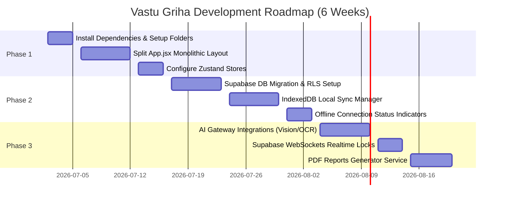

Platform:
BanjaraBazaarOS

Module:
Vastu Griha

Document:
Implementation Gap Analysis

Version:
1.0

Status:
Review

Owner:
Product Team

Last Updated:
2026-07-01

---

## Platform Overview

BanjaraBazaarOS is the unified operating system powering all Banjara Bazaar digital products.

Current modules include:
• Marketplace
• Vendor Portal
• CRM
• Inventory
• Orders
• Payments
• Notifications
• AI Gateway
• RentPro
• Vastu Griha

Future modules may be added without affecting the platform architecture.

Vastu Griha is one module within this ecosystem and must always reuse shared platform services whenever possible.

---

## 1. Executive Summary

This document presents a comprehensive architectural implementation gap analysis comparing the approved Vastu Griha Module specifications against the active codebase. 

The audit reveals that while the frontend UI layout is mostly complete as a high-fidelity client-side interactive prototype (featuring a fully functional canvas editor, plot boundary tracer, Vastu compass, onboarding screens, and remedies shop UI), it operates as a standalone prototype. 

The core architecture, state engines, databases, security limits, offline queues, and API pathways required to run Vastu Griha as an integrated module within the **BanjaraBazaarOS** platform are completely missing in the codebase.

The primary engineering tasks ahead focus on Refactoring the monolithic UI into modular directories, implementing Zustand global state management, establishing connection channels to Supabase with Row Level Security, routing AI processes to the platform's AI Gateway, and configuring offline Service Worker/IndexedDB synchronization.

---

## 2. Architecture Health Score

An evaluation was performed across the core engineering vectors of the module. The ratings are computed based on the ratio of implemented production-ready logic to the expected platform specification rules.

| Architectural Layer | Implementation Status | Health Rating | Remarks |
| :--- | :--- | :---: | :--- |
| **Frontend UI Layout** | Visual structures are mostly in place. The canvas workspace, drag-and-drop systems, compass angles, and onboarding wizard steps are operational. | **70%** | Standard module folder segmentation (features, hooks, stores) is missing. |
| **Global State Management** | The application runs on local component states inside `App.jsx`, causing extensive prop-drilling. Zustand stores do not exist. | **0%** | Not started. |
| **Database & Auth Integration** | No Supabase client dependencies exist. Shared SSO login context, JWT propagation, and RLS validations are missing. | **0%** | Not started. |
| **PWA & Offline Strategy** | Service worker caching, local IndexedDB sync queueing, and connection recovery buffers are not configured. | **0%** | Not started. |
| **AI Processing Gateway** | Ingestion, Vision model calls, and OCR prompts are mocked client-side using `setTimeout` loops. | **10%** | Prompts are documented in specs but not coded in APIs. |
| **Realtime Collaboration** | No multi-user presence channels, active element locks, or merge resolution triggers are implemented. | **0%** | Not started. |

### Overall Architecture Health Score

```mermaid
gantt
    title Architecture Layer Implementation Health (Overall: 25%)
    dateFormat  X
    axisFormat %d%%
    
    section Frontend UI
    Implemented UI Layout       :active, 0, 70
    Remaining Refactoring       : 70, 100
    
    section Core Infrastructure
    Zustand Stores              :crit, 0, 0
    Supabase DB Connection      :crit, 0, 0
    SSO JWT Auth                :crit, 0, 0
    Offline Sync Queue          :crit, 0, 0
    AI Gateway Integration      :crit, 0, 10
    Realtime Sockets            :crit, 0, 0
```



---

## 3. Feature Completion Matrix

This matrix classifies the status of every core user-facing and backend feature against the approved design specs.

| Feature Name | Status | Current Implementation | Expected Implementation | Recommended Action | Priority | Effort |
| :--- | :---: | :--- | :--- | :--- | :---: | :---: |
| **SSO Authentication** | 🔴 | No login check. App displays welcome screen directly. | Shared authentication token validation on startup. Redirects to platform login if invalid. | Implement token listener hooks using Supabase clients. | Critical | Med |
| **Planner Canvas** | 🟡 | Interactive canvas dragging and resizing of rooms inside local React arrays. | Elements snap to grid, display thickness, track undo/redo stacks, and sync layout metrics. | Migrate state arrays to a global Zustand store, and implement snapping and history hooks. | High | High |
| **Vastu Audit Rules** | 🟡 | Deterministic checks run on local rooms array using static ratings in `AnalysisPanel.jsx`. | Dynamic, sector-aligned scoring joined with layout databases. | Expose local calculations to the Zustand canvas store. | High | Med |
| **Vedic Remedies Shop**| 🟡 | Layout UI displays remedies, but "Buy Now" triggers mock popups. | Platform checkout catalog routing with payments gateway. | Connect buy actions to platform Marketplace orders API. | Medium | Med |
| **PDF Audits Export** | 🟡 | A local component stub prints the screen contents. | Serverless PDF generation compiling vectors and score tables. | Route layout coordinate data to a PDF template compiler. | Medium | Med |
| **Acharya AI Chat** | 🟡 | Renders chat interface with static mocked response strings. | Real-time streaming API queries utilizing prompt specifications. | Route chat prompts to the BanjaraBazaarOS AI Gateway. | High | Med |
| **Auto-Trace Blueprints**| 🟡 | Triggers progress loaders with `setTimeout` pushing static coordinate mockups. | Multi-modal vision model ingestion (Vision / OCR prompts). | Upload canvas drawings to AI Gateway edge functions. | High | High |
| **Realtime Collaboration**| 🔴 | No connection sockets exist. | Multiple users editing the same canvas concurrently. | Set up Supabase presence channels and edit locks. | Low | High |
| **Offline Sync Queue** | 🔴 | Offline edits are not cached. Network errors abort saves. | IndexedDB write buffers with auto-sync and merge. | Write sync manager service linking local IndexedDB to Supabase. | Critical | High |

---

## 4. Module Completion Matrix

The completeness of Vastu Griha sub-systems compared to target platform capabilities:

```
Sub-System   | Status | Completeness % | Primary Dependency
-------------|--------|----------------|---------------------
UI Planner   | 🟡      | 65%            | vanilla CSS, tabler-icons
Core Auth    | 🔴      | 0%             | Supabase Auth
Zustand Store| 🔴      | 0%             | Zustand library
Supabase DB  | 🔴      | 0%             | Supabase PostgreSQL
AI Gateway   | 🔴      | 0%             | AI Gateway API
Offline Sync | 🔴      | 0%             | IndexedDB / Service Worker
```

---

## 5. Missing Components

According to the **Engineering Guidelines (Spec 06)**, the module must reorganize its structure into clean, reusable layers. The following directories and code components are missing:

* **`/src/stores/` (State Stores)**:
  * `canvasStore.ts`: Missing. Must hold the active plot coordinates, selected room IDs, scale multipliers, and history stacks.
  * `authStore.ts`: Missing. Must track active user profile IDs and platform session scopes.
* **`/src/hooks/` (Shared Hooks)**:
  * `useAutosave.ts`: Missing. Must handle the 1500ms debounced auto-sync to local caches.
  * `useSupabaseSync.ts`: Missing. Must monitor network status and push local IndexedDB queues.
* **`/src/lib/` (Libraries)**:
  * `supabaseClient.ts`: Missing. Needs initialization using environment variables.
* **`/src/services/` (Services)**:
  * `api.ts`: Missing. Core endpoint mapping for project CRUD, uploads, and chat.
* **`tests/` (Testing Suites)**:
  * No unit tests, mock API intercepts (MSW), or Playwright E2E automation scripts are present.

---

## 6. Missing Database Objects

The **Database & API Specification (Spec 07)** outlines 37 database tables. Currently, **0 of these tables are implemented** in the Supabase PostgreSQL environment.

The following module tables must be created via future migration runs:
* **Project Management**: `projects`, `project_members`, `project_versions`, `project_activity`, `shared_links`.
* **Geometry Vectors Layout**: `plots`, `plot_boundaries`, `roads`, `compound_walls`, `gates`, `utilities`, `buildings`, `floors`, `rooms`, `walls`, `wall_segments`, `doors`, `windows`, `ventilators`, `columns`, `beams`, `stairs`, `balconies`, `room_objects`, `furniture`.
* **Vastu Audit & Commerce**: `vastu_scores`, `audit_reports`, `audit_rules`, `recommendations`, `product_recommendations`, `placement_history`.
* **AI Telemetry & Dialogue**: `chat_sessions`, `chat_messages`, `ai_requests`, `ai_responses`.
* **Collaboration & Media**: `comments`, `attachments`.

---

## 7. Missing APIs

The API catalog defined in Spec 07 is entirely missing in the codebase. The following routing actions must be registered at the platform gateway:

* **Projects API Group**: `POST /api/v1/vastu/projects` (Create), `GET /api/v1/vastu/projects/:id` (Retrieve coords), `DELETE /api/v1/vastu/projects/:id` (Soft delete).
* **Planner API Group**: `PUT /api/v1/vastu/projects/:id/layout` (Write changes).
* **AI Processing Group**: `POST /api/v1/vastu/projects/:id/upload` (Ingest drawing), `POST /api/v1/vastu/projects/:id/audit` (Audit layout), `POST /api/v1/vastu/ai/chat` (Acharya dialogue stream).
* **Collaboration Group**: `POST /api/v1/vastu/projects/:id/collaborators` (Share tokens).

---

## 8. Missing UI Screens

While the primary interactive screens exist as layouts in `App.jsx`, several support flows and indicator components are missing:

* **SSO Redirect Screen**: A loading placeholder displayed while the app validates the platform JWT.
* **Autosave / Connection Status Banners**: A visual banner at the top of the canvas workspace indicating whether changes are saved to the cloud, queued locally (`Offline Mode`), or syncing.
* **Conflict Resolution Popup Dialog**: Prompts user choice (Keep Local vs Overwrite from Cloud) when offline edits overlap with remote server updates.
* **Version History Manager Sidebar**: A UI sidebar panel listing layout versions, commit comments, and triggering layout restorations.

---

## 9. Missing AI Features

* **AI Prompts Execution**: The application does not interface with LLM endpoints. The layout auto-trace and Acharya chat operate on mock functions in `App.jsx` and `AiChat.jsx`.
* **Image Upload Ingestion Pipeline**: In `FloorPlanUpload.jsx`, the file uploader creates local object URLs (`URL.createObjectURL(file)`) but does not upload drawings to the cloud media storage bucket or trigger the AI Gateway vision processor.

---

## 10. Technical Debt

* **Monolithic `App.jsx`**:
  - *Description*: The root file contains **over 2140 lines of code**, combining screens routers, onboarding steps, layout definitions, nudging actions, modal toggles, and raw SVG vectors.
  - *Implication*: Violates the Engineering Guidelines' rule of limiting component file lengths to 250 lines. High maintenance complexity and difficulty running test suites.
  - *Correction*: Split onboarding screens into a separate wizard stepper, extract custom inline SVG arrays to an asset file, and export canvas button logic to isolated hooks.
* **Inline CSS overrides**:
  - *Description*: Multiple elements inside `App.jsx` use inline styles instead of CSS classes or variables.
  - *Implication*: Complicates style changes and theme transitions.

---

## 11. Documentation Conflicts

* **Global Zustand Store vs Local Component State**:
  * *Conflict*: Spec 06 and Spec 07 lock state management to a Zustand store, but the codebase uses React states inside `App.jsx` and drills values down to children.
* **Zustand Persistence vs Manual local storage**:
  * *Conflict*: UI Spec 02 details that layout state is synced to `localStorage`, but Database Spec 07 states layout sync is managed via Zustand offline buffers in IndexedDB.
* **Folder Structures**:
  * *Conflict*: Spec 06 outlines that components must sit under folders: `/src/features/`, `/src/stores/`, `/src/hooks/`, but the codebase places all components flatly under `/src/components/`.

---

## 12. Quick Wins

* **Install core dependencies**: run `npm install zustand @supabase/supabase-js idb zod` to configure packages.
* **Refactor folder directories**: Create the target directories `/src/stores/`, `/src/hooks/`, `/src/lib/`, and `/src/services/`.
* **Split `App.jsx`**: Extract inline onboarding wizard steps into a standalone component (`OnboardingWizard.jsx`), reducing the footprint of the root coordinator.
* **Extract SVGs**: Move the `GOAL_SVGS` and `STYLE_SVGS` arrays from `App.jsx` to an external file.

---

## 13. High Risk Areas

* **Real-time Sync Collision**:
  - *Risk*: Without robust locking rules and version counters, two users modifying the same room on different devices concurrently could overwrite each other's edits, causing layout corruption.
  - *Mitigation*: Strictly implement the WebSocket presence node locking policy outlined in Database Spec 07.
* **Local Coordinate Multiplier Drift**:
  - *Risk*: Converting percentage coordinates (`0%` to `100%`) on mobile canvases to real-world feet/meters during PDF printing could result in rounding errors, causing walls or doors to misalign.
  - *Mitigation*: Establish strict conversion scale rules inside a centralized coordinate utility.

---

## 14. Recommended Development Roadmap



### Phase 1: Foundation & Refactoring (Weeks 1 - 2)
* **Goal**: Refactor the frontend UI code into modular guidelines, establish the global Zustand stores, and integrate platform SSO authentication.
* **Dependencies**: None.

### Phase 2: Database Schema & Local Sync Queue (Weeks 3 - 4)
* **Goal**: Deploy PostgreSQL tables in Supabase, define security rules (RLS policies), construct local IndexedDB write buffers, and build connection status banners.
* **Dependencies**: Phase 1 stores.

### Phase 3: Realtime Collaboration & AI Integrations (Weeks 5 - 6)
* **Goal**: Connect the AI Gateway, set up vision/OCR prompts, deploy the PDF report compiler, and set up WebSocket editing locks.
* **Dependencies**: Phase 2 databases.

---

## Related Documents
* [Master Product Spec](file:///c:/Users/DELL/BanjaraBazaarOS/apps/vastu-griha/docs/01_Master_Product_Spec_v1.0.md)
* [UI/UX Guidelines](file:///c:/Users/DELL/BanjaraBazaarOS/apps/vastu-griha/docs/02_UI_UX_Guidelines_v1.0.md)
* [Component Library](file:///c:/Users/DELL/BanjaraBazaarOS/apps/vastu-griha/docs/03_Component_Library_v1.0.md)
* [Asset Pipeline](file:///c:/Users/DELL/BanjaraBazaarOS/apps/vastu-griha/docs/04_Asset_Pipeline_v1.0.md)
* [AI Prompt Library](file:///c:/Users/DELL/BanjaraBazaarOS/apps/vastu-griha/docs/05_AI_Prompt_Library_v1.0.md)
* [Engineering Guidelines](file:///c:/Users/DELL/BanjaraBazaarOS/apps/vastu-griha/docs/06_Engineering_Guidelines_v1.0.md)
* [Database & API](file:///c:/Users/DELL/BanjaraBazaarOS/apps/vastu-griha/docs/07_Database_API_v1.0.md)
* [Analytics](file:///c:/Users/DELL/BanjaraBazaarOS/apps/vastu-griha/docs/08_Analytics_and_Events_v1.0.md)
* [Error States](file:///c:/Users/DELL/BanjaraBazaarOS/apps/vastu-griha/docs/09_Error_States_v1.0.md)
* [Deployment](file:///c:/Users/DELL/BanjaraBazaarOS/apps/vastu-griha/docs/10_Deployment_Performance_v1.0.md)
