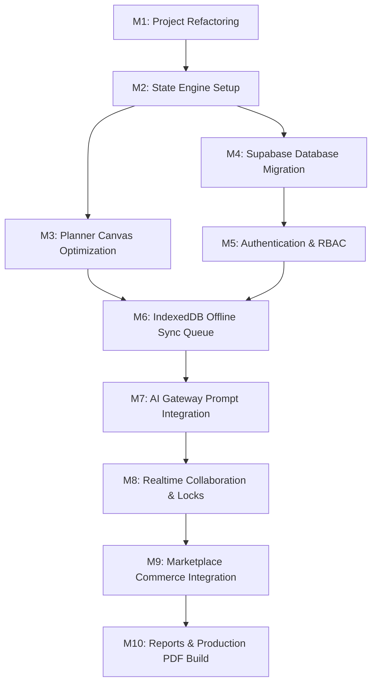
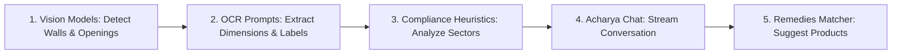

Platform:
BanjaraBazaarOS

Module:
Vastu Griha

Document:
Implementation Master Roadmap

Version:
1.0

Status:
Review

Owner:
Product Team

Last Updated:
2026-07-01

---

## Platform Overview

BanjaraBazaarOS is the unified operating system powering all Banjara Bazaar digital products.

Current modules include:
• Marketplace
• Vendor Portal
• CRM
• Inventory
• Orders
• Payments
• Notifications
• AI Gateway
• RentPro
• Vastu Griha

Future modules may be added without affecting the platform architecture.

Vastu Griha is one module within this ecosystem and must always reuse shared platform services whenever possible.

---

## 1. Executive Summary

This document establishes the official Implementation Master Roadmap for the Vastu Griha Module integrated within the BanjaraBazaarOS Platform. 

Building upon the approved specifications and the structural findings of the Implementation Gap Analysis, this document details a milestone-driven execution plan. Rather than generic project timelines, this blueprint coordinates dependencies, migration sequences, component build orders, testing schedules, and security boundaries.

---

## 2. Current Architecture Status

The codebase is currently a client-side high-fidelity interactive visual prototype. Layout modifications, coordinates scaling, Vastu compliance indicators, uploader mockups, and remedies lists operate strictly on local React component state hooks in memory. 

To bridge the gap between this prototype and the production specification:
1. **The codebase must be refactored** out of the monolithic `App.jsx` structure.
2. **Standard framework modules** must be integrated (Zustand state store, Supabase DB client, IndexedDB caching, and platform SSO bearer tokens).
3. **Mocks must be replaced** with platform connections (marketplace order checking APIs and the AI Gateway prompts engine).

---

## 3. Architecture Compliance Matrix

This matrix tracks the compliance of the current codebase against the specifications defined in approved files:

| Specification Document | Required Architecture | Codebase Status | Compliance |
| :--- | :--- | :--- | :---: |
| **01 Master Product Spec** | User onboarding flows, vector drawing canvas, remedies listings. | High-fidelity interactive layouts are implemented. | **75%** |
| **02 UI/UX Guidelines** | 8px grids spacing, mobile thumb navigation zones, bottom sheets. | Component margins and layout panels conform to rules. | **80%** |
| **03 Component Library** | Isolated UI elements, properties inputs, dialogue states. | Layout codes exist but are grouped within `App.jsx`. | **60%** |
| **04 Asset Pipeline** | Minified SVGs, compressed WebP, Draco 3D models budgets. | File placeholders exist, but budget scripts are missing. | **30%** |
| **05 AI Prompt Library** | Complete Vision/OCR schemas, prompt execution versions. | System prompts are defined but not routed to endpoints. | **10%** |
| **06 Engineering Guidelines**| Zustand state, service worker offline caches, unit test suites. | No state stores, service workers, or test scripts exist. | **0%** |
| **07 Database & API Spec** | 37 database tables, RLS security profiles, 10 API routes. | No databases, Supabase client hooks, or APIs exist. | **0%** |

---

## 4. Critical Blockers

Development is currently blocked by four core architectural dependencies:

```
[Monolithic App.jsx] ➔ Blocks Modularization
Currently holds 2,140 lines combining routing, canvas rendering, and styles.
Must be split before adding routing configurations or unit tests.

[No Zustand Store] ➔ Blocks Realtime Collaboration
Layout state resides in local React hooks, preventing socket synchronization
and canvas locking hooks.

[No Supabase Integration] ➔ Blocks Persistence
Layout states and user histories are lost on tab refresh.
Must deploy DB tables and Supabase clients.

[No AI Gateway Bindings] ➔ Blocks Vision/OCR Ingestion
Blueprint auto-tracing and chat consults rely on local client setTimeout mocks.
Must link endpoints to the platform's AI Gateway.
```

---

## 5. Dependency Graph

The sequence of implementation milestones is determined by technical dependencies:



---

## 6. Implementation Milestones

### Milestone 1: Project Refactoring (`M1`)
* **Goal**: Modularize the monolithic codebase to establish a clean folder structure.
* **Deliverables**:
  * Create directories: `/src/stores/`, `/src/hooks/`, `/src/features/`, `/src/lib/`, `/src/services/`.
  * Split onboarding steps from `App.jsx` into `OnboardingWizard.jsx`.
  * Extract `GOAL_SVGS`, `STYLE_SVGS`, and `EXPANDED_ROOMS_CATALOG` to `src/assets/constants.js`.
* **Dependencies**: None.
* **Definition of Done**: App builds successfully without compiler warnings. File `App.jsx` has < 250 lines. Lint checks pass.
* **Estimated Complexity**: Medium.
* **Risk Level**: Low.

---

### Milestone 2: State Engine (`M2`)
* **Goal**: Implement global state management using Zustand.
* **Deliverables**:
  * Create `src/stores/canvasStore.ts` holding room arrays, selection states, and compass values.
  * Create `src/stores/authStore.ts` tracking active JWT session scopes.
  * Implement undo/redo history operations with a history length limit of 50 states.
* **Dependencies**: `M1`.
* **Definition of Done**: Direct component state drilling is replaced with store actions. Undo and redo actions correctly step layouts back and forward.
* **Estimated Complexity**: Medium.
* **Risk Level**: Low.

---

### Milestone 3: Planner Canvas (`M3`)
* **Goal**: Optimize planner canvas interactions.
* **Deliverables**:
  * Implement room element border highlights and rotate/resize visual guides.
  * Add coordinate snapping triggers locking movements to the standard 8px grid.
  * Incorporate wall thickness values (9" external, 4.5" internal) into room spacing math.
* **Dependencies**: `M2`.
* **Definition of Done**: Placed room blocks snap to grid divisions during drag and resize interactions.
* **Estimated Complexity**: High.
* **Risk Level**: Medium.

---

### Milestone 4: Database Integration (`M4`)
* **Goal**: Set up database connections and database configurations.
* **Deliverables**:
  * Initialize Supabase client inside `src/lib/supabaseClient.ts`.
  * Write migrations to deploy all 37 database tables.
  * Set up foreign key cascading rules and composite queries indexes.
* **Dependencies**: `M2`.
* **Definition of Done**: Schema migrations run successfully without errors. Local Supabase CLI confirms all Vastu tables exist.
* **Estimated Complexity**: High.
* **Risk Level**: Medium.

---

### Milestone 5: Authentication & RBAC (`M5`)
* **Goal**: Integrate SSO authentication and set up access permissions.
* **Deliverables**:
  * Set up authentication hooks retrieving platform JWT bearer tokens.
  * Write Row Level Security (RLS) policies linking user IDs to profile tables.
  * Apply permission checks restricting edits based on team roles (Owner, Editor, Consultant, Viewer).
* **Dependencies**: `M4`.
* **Definition of Done**: Access token validation checks successfully intercept project queries. Unauthorized reads return database RLS violations.
* **Estimated Complexity**: Medium.
* **Risk Level**: High (Critical for data privacy).

---

### Milestone 6: Offline Sync (`M6`)
* **Goal**: Implement IndexedDB caching and background sync capabilities.
* **Deliverables**:
  * Configure IndexedDB layout storage wrappers.
  * Build a synchronization manager queueing database write requests when offline.
  * Add warning indicators alerting users of connection status changes.
* **Dependencies**: `M3`, `M5`.
* **Definition of Done**: Layout edits made in disconnected mode save locally, show the "Offline Mode" warning, and sync automatically on reconnection.
* **Estimated Complexity**: High.
* **Risk Level**: High.

---

### Milestone 7: AI Gateway (`M7`)
* **Goal**: Route Vastu prompts to the platform's AI Gateway.
* **Deliverables**:
  * Link uploader component to AI Gateway endpoints.
  * Integrate blueprint auto-tracing utilizing vision prompts (`VP-001` through `VP-022`).
  * Replace mock conversational loops with active streaming responses.
* **Dependencies**: `M6`.
* **Definition of Done**: Uploaded floor plans are parsed, outputting bounding coordinates of walls, doors, and rooms. Acharya chat outputs LLM streams.
* **Estimated Complexity**: High.
* **Risk Level**: Medium.

---

### Milestone 8: Realtime Collaboration (`M8`)
* **Goal**: Implement multi-user live editing capabilities.
* **Deliverables**:
  * Bind planner canvas to Supabase presence WebSockets.
  * Build edit locking protocols disabling drag options on nodes edited by other members.
  * Set up conflict resolution rules parsing concurrent updates.
* **Dependencies**: `M7`.
* **Definition of Done**: Selection indicators and cursor positions sync across different test browsers with under 100ms latency.
* **Estimated Complexity**: High.
* **Risk Level**: Medium.

---

### Milestone 9: Marketplace Integration (`M9`)
* **Goal**: Link remedies shop to the BanjaraBazaarOS Marketplace.
* **Deliverables**:
  * Map Vastu score recommendations checklist to actual commerce catalog products.
  * Set up redirect endpoints linking "Buy Now" actions to marketplace checkout sheets.
* **Dependencies**: `M8`.
* **Definition of Done**: Selecting a Vastu remedy opens the platform checkout view, pre-populated with correct product parameters and pricing.
* **Estimated Complexity**: Medium.
* **Risk Level**: Low.

---

### Milestone 10: Reports & Production (`M10`)
* **Goal**: Deploy automated reports compilation and run final production validation checks.
* **Deliverables**:
  * Implement serverless PDF report generation compiling layout graphics and Vastu recommendations.
  * Complete full unit test coverage (target >= 85%) and run Playwright E2E suites.
* **Dependencies**: `M9`.
* **Definition of Done**: Build compiles to optimized chunks within performance limits. PDF reports download successfully.
* **Estimated Complexity**: Medium.
* **Risk Level**: Low.

---

## 7. Component Build Order

To prevent dependencies bottlenecks, frontend components must be built in this order:

1. **`WorkspaceLayout`**: The outer structural frame, resolving responsive split panes.
2. **`CanvasGrid`**: Checkered canvas coordinate area, displaying standard grid outlines.
3. **`RoomBlock`**: Interactive room card displaying dimensions and validation indicators.
4. **`NudgeController`**: Thumb-zone buttons panel to move rooms on mobile devices.
5. **`VastuCompass`**: Rotatable compass overlay indicating compliance zones.
6. **`OnboardingWizard`**: Multi-page properties questionnaire.
7. **`RemediesList`**: Grid catalog rendering remedy cards.
8. **`AcharyaChatWindow`**: Chat interface dialogue frame.
9. **`AuditStatusList`**: Accordion panel listing Vastu compliance warnings.
10. **`SyncStatusBanner`**: Small banner indicating offline caching or sync actions.
11. **`ConflictResolutionDialog`**: Choice popup resolving local/cloud data collisions.

---

## 8. Database Build Order

Database tables must be deployed in matching migration cycles:

```
Cycle 1: Core References
Profiles & Products joins metadata setup.

Cycle 2: Root Projects
Deploy: `projects` ➔ `project_members`.

Cycle 3: Layout Properties
Deploy: `plots` ➔ `plot_boundaries` ➔ `roads` ➔ `compound_walls` ➔ `gates` ➔ `utilities`.

Cycle 4: Building Envelopes
Deploy: `buildings` ➔ `floors` ➔ `rooms` ➔ `walls` ➔ `wall_segments`.

Cycle 5: Room Interior Fixtures
Deploy: `doors` ➔ `windows` ➔ `ventilators` ➔ `columns` ➔ `beams` ➔ `stairs` ➔ `balconies` ➔ `room_objects` ➔ `furniture`.

Cycle 6: Audit Results
Deploy: `vastu_scores` ➔ `audit_reports` ➔ `audit_rules` ➔ `recommendations` ➔ `product_recommendations` ➔ `placement_history`.

Cycle 7: AI & Collaboration Loggers
Deploy: `chat_sessions` ➔ `chat_messages` ➔ `ai_requests` ➔ `ai_responses` ➔ `project_versions` ➔ `project_activity` ➔ `shared_links` ➔ `comments` ➔ `attachments`.
```

---

## 9. API Build Order

Backend route configurations must be deployed in this sequence:

1. **Projects Routing**: `POST /api/v1/vastu/projects` (Create) and `GET /api/v1/vastu/projects` (List).
2. **Layout Sync API**: `PUT /api/v1/vastu/projects/:id/layout` (Write changes) and `GET /api/v1/vastu/projects/:id` (Retrieve coords).
3. **Storage Uploads API**: `POST /api/v1/vastu/projects/:id/upload` (Upload floor plans to media bucket).
4. **Audit Calculations Endpoint**: `POST /api/v1/vastu/projects/:id/audit` (Evaluate layout).
5. **Acharya AI Messaging**: `POST /api/v1/vastu/ai/chat` (Submit queries to Chat).
6. **Remedies Catalog Fetch**: `GET /api/v1/marketplace/products` (Retrieve remedy list).
7. **Collaborators Perms Handler**: `POST /api/v1/vastu/projects/:id/collaborators` (Assign roles).
8. **Versions Control Snapshots**: `GET /api/v1/vastu/projects/:id/versions` (Browse snapshots).

---

## 10. AI Integration Order

AI prompt models must be connected in the following order:



1. **Vision Models**: Bounding detections (`VP-001`), wall coordinates (`VP-002`), thickness (`VP-003`), doors (`VP-004`), windows (`VP-005`), and compass icons (`VP-006`).
2. **OCR Prompts**: Dimension values extraction (`OCR-001`), room labels (`OCR-003`), scale indicators (`OCR-005`).
3. **Planner Heuristics**: Room zone checks (`AP-001`), entrance grid pada checks (`AP-002`), water placement checks (`AP-006`).
4. **Vastu Acharya Chat**: Streaming conversation prompts, layout contexts integration, override actions.
5. **Remedies Catalog Matcher**: Suggest product catalog SKUs matching score deductions.

---

## 11. Testing Strategy

| Milestone | Target Testing Scope | Testing Framework | Validation Criteria |
| :--- | :--- | :--- | :--- |
| **M1 & M2** | Zustand store actions and state history. | Vitest | State mutations successfully track coordinate changes. |
| **M3** | Canvas snapping, sizing, and nudge controls. | Playwright component test | Room boundaries stick to 8px intervals. |
| **M4 & M5** | Database CRUD and RLS policy rules. | Vitest + Supabase Client | Direct SELECT calls reject unless user token matches. |
| **M6** | IndexedDB offline writes and sync queue. | Vitest + MSW | Offline modifications successfully upload on network link. |
| **M7** | Vision API response parsing. | Prompt golden tests | Coordinate outputs parse to matching JSON schemas. |
| **M8** | Canvas WebSocket locks. | Playwright e2e | Concurrent edits block active room nodes. |
| **M9 & M10** | Commerce checkout redirect, PDF compile. | Playwright e2e | Report compiles to PDF; Buy Now links open orders. |

---

## 12. Release Strategy

The rollout plan is designed to gather feedback while validating performance budgets:

```
[Internal Alpha] ➔ Refactoring Validation
Target: Development Team
Scope: Local refactoring validation, Zustand store execution checks.

[Private Beta] ➔ Technical Architecture Checks
Target: Selected Builders / Real Estate Partners
Scope: Supabase DB persistence checks, offline sync calculations, CAD import.

[Staff Testing] ➔ Performance Checks
Target: BanjaraBazaar Employees
Scope: Mobile PWA caching, network speeds check, AI Gateway prompt costs monitoring.

[Family Testing] ➔ Usability Checks
Target: Non-technical users
Scope: Screen reader accessibility validation, mobile layout checks, navigation flow.

[Public Beta] ➔ Realtime Testing
Target: Live Staging Environment
Scope: WebSocket concurrent edits checks, transaction gateway checkout audits.

[Production Launch] ➔ Global Release
Target: All Platform Users
Scope: Multi-tenant, edge-replicated Vastu Griha Module release (v1.0.0).
```

---

## Related Documents
* [Master Product Spec](file:///c:/Users/DELL/BanjaraBazaarOS/apps/vastu-griha/docs/01_Master_Product_Spec_v1.0.md)
* [UI/UX Guidelines](file:///c:/Users/DELL/BanjaraBazaarOS/apps/vastu-griha/docs/02_UI_UX_Guidelines_v1.0.md)
* [Component Library](file:///c:/Users/DELL/BanjaraBazaarOS/apps/vastu-griha/docs/03_Component_Library_v1.0.md)
* [Asset Pipeline](file:///c:/Users/DELL/BanjaraBazaarOS/apps/vastu-griha/docs/04_Asset_Pipeline_v1.0.md)
* [AI Prompt Library](file:///c:/Users/DELL/BanjaraBazaarOS/apps/vastu-griha/docs/05_AI_Prompt_Library_v1.0.md)
* [Engineering Guidelines](file:///c:/Users/DELL/BanjaraBazaarOS/apps/vastu-griha/docs/06_Engineering_Guidelines_v1.0.md)
* [Database & API](file:///c:/Users/DELL/BanjaraBazaarOS/apps/vastu-griha/docs/07_Database_API_v1.0.md)
* [Implementation Gap Analysis](file:///c:/Users/DELL/BanjaraBazaarOS/apps/vastu-griha/docs/Implementation_Gap_Analysis_v1.0.md)
* [Analytics](file:///c:/Users/DELL/BanjaraBazaarOS/apps/vastu-griha/docs/08_Analytics_and_Events_v1.0.md)
* [Error States](file:///c:/Users/DELL/BanjaraBazaarOS/apps/vastu-griha/docs/09_Error_States_v1.0.md)
* [Deployment](file:///c:/Users/DELL/BanjaraBazaarOS/apps/vastu-griha/docs/10_Deployment_Performance_v1.0.md)
