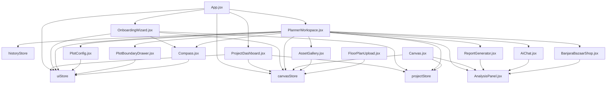

# Dependency Graph — Vastu Griha

Audit date: 2026-07-03

## Readable summary

- `App.jsx` is the only top-level router.
- `ProjectDashboard.jsx` is the startup project list and launcher.
- `OnboardingWizard.jsx` seeds a layout and hands off to the planner.
- `PlannerWorkspace.jsx` is the main editor shell.
- `AnalysisPanel.jsx` is the canonical analysis engine shared by the editor, reports, and chat.
- `canvasStore` is the persistence boundary for layouts.
- `projectStore` is the persistence boundary for project lists.

