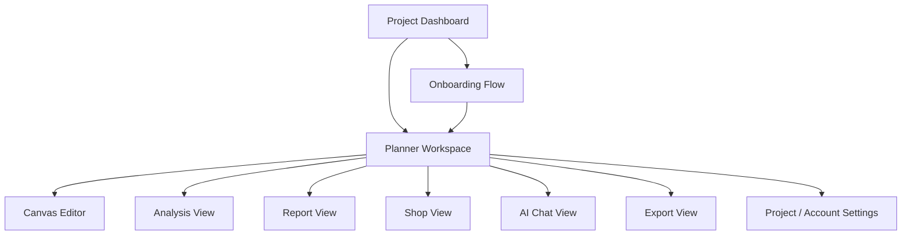
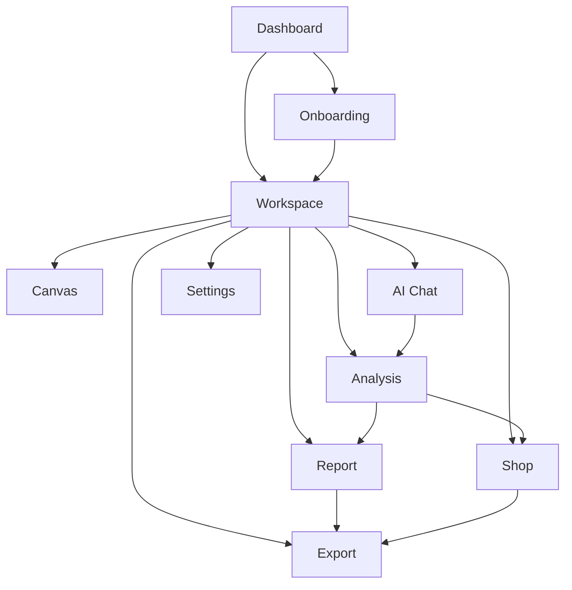
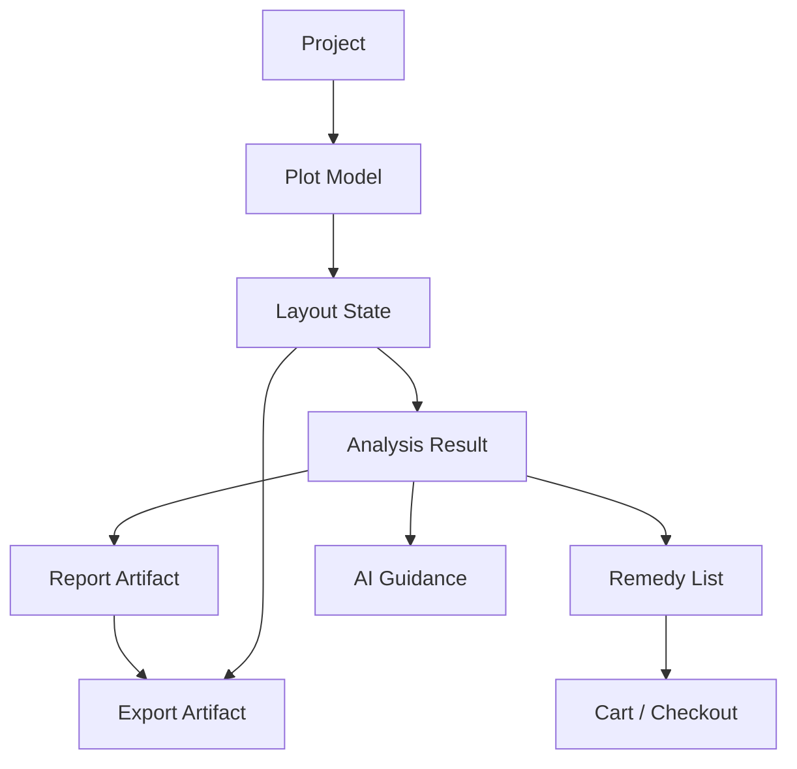
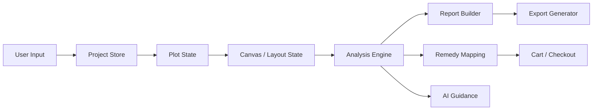
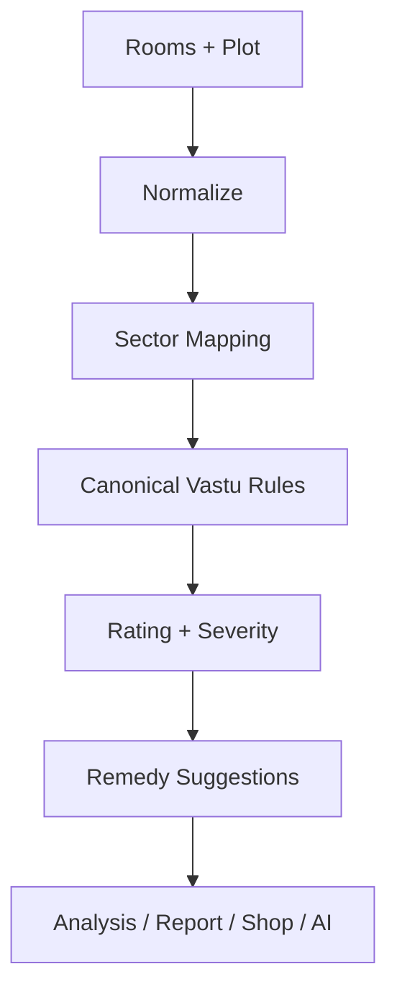
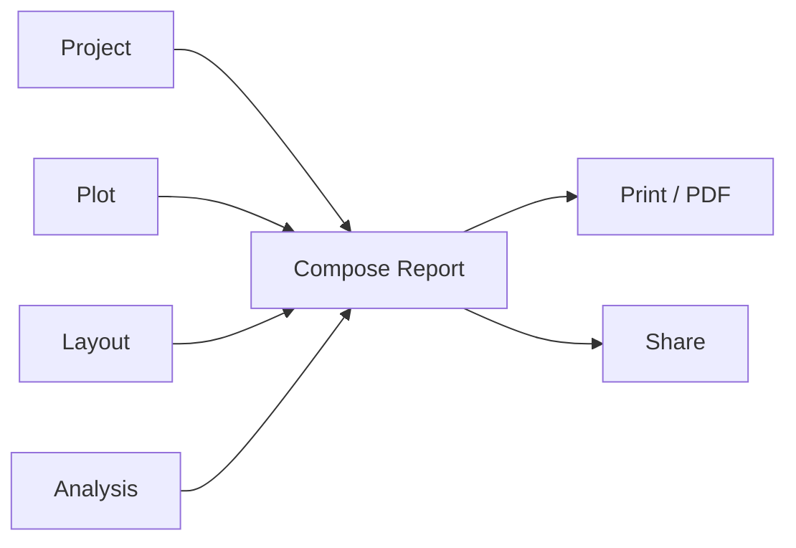
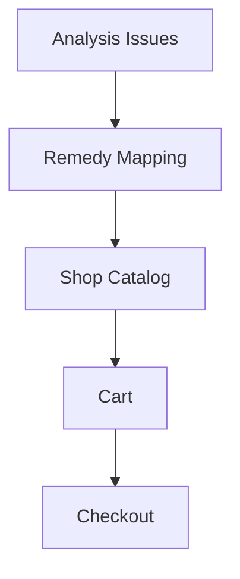

# Product Architecture — Vastu Griha

Status: proposed target architecture

This document is the single source of truth for the future product after consolidation. It describes the system as it should exist in production, not as it exists today.

## 1) Product Vision

Vastu Griha is an end-to-end home planning product that helps a user move from a blank start to a final, actionable Vastu-informed report with recommendations, shopping remedies, and exportable deliverables.

The product should feel like one coherent workflow:

1. understand the home or plot,
2. generate or import a layout,
3. place rooms and assets,
4. analyze Vastu compliance,
5. produce a report,
6. convert recommendations into remedies or purchases,
7. export the final package.

The future architecture should prioritize:

- one canonical source of truth per domain,
- one navigation model,
- one analysis engine,
- one project persistence model,
- clear separation between core workflow and optional enhancements,
- clean archive boundaries for dead or legacy experiences.

## 2) User Journey: first launch → final report

### Ideal journey

1. User opens the app for the first time.
2. App shows the project dashboard with a clear “start project” CTA.
3. User chooses one of:
   - create from scratch,
   - upload a floor plan,
   - use AI-guided onboarding,
   - reopen an existing project.
4. If starting fresh, onboarding collects plot details and high-level preferences.
5. The app transitions into the planner workspace.
6. User creates or imports the layout on the canvas.
7. User places rooms and furniture items.
8. The analysis engine evaluates the layout continuously or on-demand.
9. The system presents:
   - a live Vastu score,
   - issues and remedies,
   - AI chat guidance,
   - shop recommendations.
10. User reviews the generated report.
11. User exports the report as PDF or shares it.
12. Optional: user purchases remedies or returns later to continue the project.

### Journey principles

- The user should never wonder “where am I?”.
- Every transition should have a clear destination.
- Dashboard, onboarding, and planner must feel like stages of one pipeline.

## 3) Complete Screen Hierarchy

### Top-level hierarchy



### Target screen hierarchy

1. Project Dashboard
2. Onboarding
   - plot basics
   - room needs
   - style / goal selection
   - generation preview
3. Planner Workspace
   - Canvas Editor
   - Upload / Import
   - Analysis View
   - Report View
   - Shop View
   - AI Chat View
   - Export View
   - Project Settings
4. Optional supporting screens
   - Auth / Sign-in
   - Billing / Checkout
   - Help / Support

## 4) Navigation Flow

### Primary navigation



### Navigation rules

- Dashboard is the entry point.
- Onboarding is optional for returning users only if they choose it.
- Workspace is the core operating surface.
- Analysis, report, shop, and AI chat are workspace tabs, not separate apps.
- Export is a final action surface, not a parallel workflow.

## 5) Canonical Feature Ownership

| Feature | Canonical owner | Notes |
|---|---|---|
| Project creation | Dashboard | Dashboard owns all project start decisions. |
| Project persistence | Project store | One canonical persistence boundary. |
| Onboarding questions | Onboarding flow | Collects only startup data, not editor state. |
| Layout editing | Canvas subsystem | Owns room placement and geometry. |
| Vastu scoring | Analysis engine | Single source of truth. |
| Report rendering | Report pipeline | Read-only projection of project + analysis. |
| Remedy suggestions | Analysis + Shop | Analysis decides issues; Shop operationalizes remedies. |
| AI guidance | AI workflow | Contextual assistant, not a separate plan source. |
| Export | Export pipeline | Produces shareable artifacts. |
| Notifications / collaboration | Workspace services | Secondary product layer, not the core path. |

## 6) Feature Dependency Graph



### Dependency intent

- `Project` is the root aggregate.
- `Plot` and `Layout` are core derived state.
- `Analysis` is derived from plot + layout.
- `Report`, `Remedies`, `AI`, and `Export` are downstream projections.

## 7) Screen Responsibility Matrix

| Screen | Purpose | Owner | Entry Point | Exit Point | Store Dependencies | Business Logic | Can it be reused? | Should it survive consolidation? |
|---|---|---|---|---|---|---|---|---|
| Project Dashboard | Start, resume, and organize projects | Dashboard feature owner | App startup | Onboarding or Workspace | Project store, UI store | project list management, project selection, quick entry cards | Yes, as the canonical home screen | Yes |
| Onboarding | Collect plot and project intent | Onboarding feature owner | Dashboard new-project CTA | Workspace | Project store, UI store, temporary wizard store | user intake, plot bootstrap, guided generation | Yes, as a reusable flow component | Yes |
| Planner Workspace | Main operating environment | Workspace feature owner | Dashboard, onboarding, project resume | Dashboard, export, settings | Project store, canvas store, UI store, history store, settings store | tab routing, workspace orchestration | Yes, as the shell of the product | Yes |
| Canvas Editor | Place and edit rooms | Canvas subsystem owner | Workspace canvas tab | Analysis / Report | Canvas store, project store, settings store | geometry edits, snapping, undo/redo, autosave | Yes | Yes |
| Analysis View | Score and diagnose the layout | Analysis owner | Workspace analysis tab | Report, Shop, AI Chat | Project store, canvas store, analysis store | Vastu evaluation, issue classification, remedies | Yes | Yes |
| Report View | Produce printable summary | Reporting owner | Workspace report tab | Export | Project store, analysis store, report store | report assembly, PDF-ready projection | Yes | Yes |
| Shop View | Turn remedies into purchasable items | Commerce owner | Workspace shop tab | Checkout / Export | Analysis store, catalog store, cart store | map issues to products, cart actions | Yes | Yes |
| AI Chat View | Conversational guidance | AI owner | Workspace AI entry | Analysis, Canvas, Report | Project store, analysis store, chat store | contextual Q&A, next-step suggestions | Yes | Yes |
| Export View | Share, download, and finalize outputs | Export owner | Report or Workspace final action | External share / file save | Report store, project store | export generation, share packaging | Yes | Yes |
| Settings / Account | Preferences and account controls | Platform owner | Workspace settings | Dashboard or Workspace | UI store, auth store, user profile store | preferences, identity, permissions | Yes | Yes, but optional |

## 8) Component Classification

### Core

Core components are required for the product to function.

- `ProjectDashboard`
- `OnboardingWizard`
- `PlannerWorkspace`
- `Canvas`
- `AnalysisPanel`
- `ReportGenerator`
- `BanjaraBazaarShop`
- `AiChat`
- `Compass`
- `PlotConfig`
- `PlotBoundaryDrawer`

### Optional

Optional components enhance the workflow but are not required for the minimum product.

- `AssetGallery`
- `FloorPlanUpload`
- `AiDesigner`
- collaboration widgets
- notification widgets
- profile widgets

### Plugin

Plugin components are feature modules that should be loadable, swappable, or product-vertical-specific.

- checkout integrations
- third-party AI providers
- premium export modules
- collaboration plugins
- analytics plugins

### Archive

Archive components are legacy or dead experiences kept only for historical reference until fully retired.

- duplicate welcome shells
- obsolete launch surfaces
- unused prototype components
- obsolete preview variants

## 9) Store Classification

### Core stores

- `projectStore`
- `canvasStore`
- `uiStore`

### Derived stores

- `analysisStore` — future dedicated analysis output store
- `reportStore` — future generated report state
- `cartStore` — future shop/cart projection
- `chatStore` — future AI conversation state

### Temporary stores

- onboarding wizard step state
- modal state
- drag state
- import preview state

### Deprecated stores

- any store that duplicates project or layout persistence
- any store that separately owns the same analysis results as the canonical analysis engine

## 10) Data Flow



### Data flow rules

- Raw input is stored once.
- Derived data should never become the primary source of truth.
- Rendering layers should read from stores or derived selectors, not reimplement logic.

## 11) Project Lifecycle

1. Create project.
2. Initialize plot.
3. Generate or import layout.
4. Edit and refine layout.
5. Analyze and score.
6. Review report.
7. Convert issues into remedies.
8. Export/share.
9. Reopen and continue later.

### Lifecycle states

- new
- onboarding
- active
- analyzed
- reported
- remedy-selected
- exported
- archived

## 12) AI Workflow

### Target AI behavior

AI should assist, not override.

### Workflow

1. Read current project context.
2. Read current plot/layout state.
3. Read analysis results.
4. Suggest next best action.
5. Offer room placement guidance.
6. Explain tradeoffs.
7. Route the user to the correct workspace tab.

### AI constraints

- AI must not be the source of truth for scoring.
- AI must not mutate layout state without user intent.
- AI should only propose, explain, or assist.

## 13) Vastu Analysis Pipeline

### Target pipeline

1. Normalize room and plot data.
2. Determine room sector.
3. Evaluate canonical Vastu rules.
4. Compute rating and severity.
5. Generate remedy suggestions.
6. Attach analysis results to the layout.
7. Surface results in analysis, report, shop, and AI views.



### Analysis invariants

- one engine,
- one rule set,
- one grading scale,
- one remedy vocabulary.

## 14) Report Generation Pipeline

1. Read project metadata.
2. Read plot and layout state.
3. Read analysis output.
4. Compose executive summary.
5. Compose room-by-room findings.
6. Compose remedy section.
7. Render print/PDF/share output.



### Report invariants

- report is read-only,
- report never re-evaluates layout independently,
- report is a projection of canonical analysis.

## 15) Shop Integration Pipeline

1. Analysis identifies issues.
2. Remedy mapping selects compatible products.
3. Shop presents suggested items.
4. User can inspect details.
5. User adds items to cart.
6. Checkout or external purchase occurs.



### Shop rules

- shop should not invent new analysis,
- shop should only react to canonical issues,
- product mapping should be configurable, not embedded in UI screens.

## 16) Future Plugin Architecture

The future product should support optional plugins without polluting the core workflow.

### Plugin categories

- AI provider plugins
- export provider plugins
- checkout provider plugins
- collaboration plugins
- analytics plugins
- theme / branding plugins

### Plugin contract

Each plugin should expose:

- id
- version
- capability category
- input contract
- output contract
- permissions
- failure mode

### Plugin boundary rule

Plugins must consume canonical store outputs and return additive results only. They must not become alternate sources of truth.

## 17) Archive Strategy (planned only)

Archive is for retired or redundant architecture that is no longer part of the product path.

### Archive principles

- never archive before an approved inventory review,
- never archive a module that still owns canonical behavior,
- archive only after the replacement path is defined,
- archive only dead or superseded surfaces,
- keep archive structure feature-aligned for easy rollback.

### Planned archive buckets

- `archive/dashboard/`
- `archive/onboarding/`
- `archive/workspace/`
- `archive/components/`
- `archive/stores/`
- `archive/prototypes/`
- `archive/legacy-analysis/`

### What should eventually land in archive

- duplicate welcome flow artifacts
- retired launchers
- obsolete preview shells
- unused prototype components
- obsolete duplicated logic after replacement is approved

## 18) Production Folder Structure (target architecture)

```text
apps/vastu-griha/
  src/
    app/
      App.jsx
      routes.jsx
    features/
      dashboard/
        ProjectDashboard.jsx
      onboarding/
        OnboardingWizard.jsx
      planner/
        PlannerWorkspace.jsx
      analysis/
        AnalysisPanel.jsx
      report/
        ReportGenerator.jsx
      shop/
        BanjaraBazaarShop.jsx
      chat/
        AiChat.jsx
      export/
        ExportPanel.jsx
      settings/
        SettingsPanel.jsx
    components/
      core/
        Canvas.jsx
        Compass.jsx
        PlotConfig.jsx
        PlotBoundaryDrawer.jsx
      optional/
        AssetGallery.jsx
        FloorPlanUpload.jsx
        AiDesigner.jsx
    stores/
      projectStore.js
      canvasStore.js
      uiStore.js
      analysisStore.js
      reportStore.js
      cartStore.js
      chatStore.js
    lib/
      geometry/
      assets/
      analysis/
      export/
    plugins/
      ai/
      export/
      checkout/
      collaboration/
    archive/
      dashboard/
      onboarding/
      workspace/
      components/
      stores/
      legacy/
    styles/
      index.css
  assets/
  public/
```

### Structure rules

- `features/` holds screen-level ownership.
- `components/` holds reusable building blocks.
- `stores/` holds the minimal canonical state layer.
- `lib/` holds pure utilities and engines.
- `plugins/` holds optional integrations.
- `archive/` is a dead-code holding area only, never a runtime dependency.

## Final architectural rule set

1. One canonical dashboard.
2. One canonical onboarding flow.
3. One canonical planner workspace.
4. One canonical canvas.
5. One canonical analysis engine.
6. One canonical project store.
7. One canonical layout store.
8. No duplicate home screens.
9. No duplicate analysis engines.
10. No runtime code should depend on archive files.

