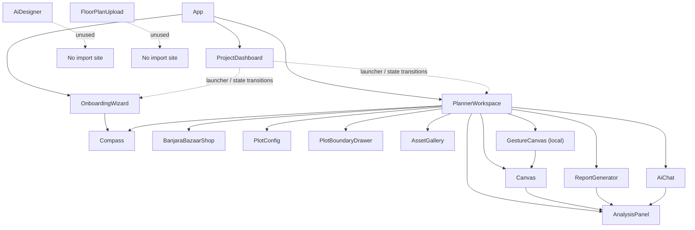
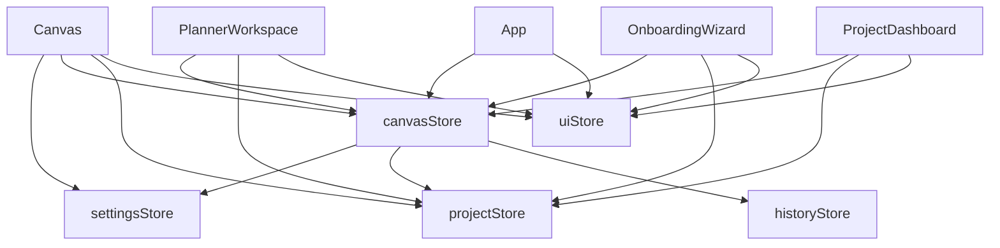
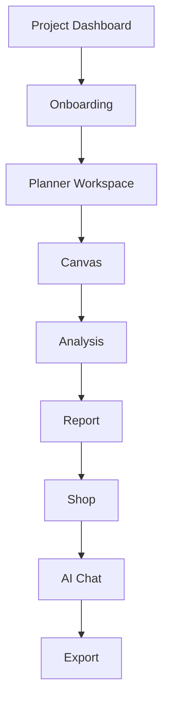

# Second-Pass Repository Audit — Vastu Griha

Audit date: 2026-07-03

Scope: `apps/vastu-griha`

This is a read-only inventory. No runtime code was changed.

## 0) Executive summary

The repository is now effectively a single source tree under `apps/vastu-griha/src`, but it still contains duplicated navigation semantics:

- `App.jsx` routes `welcome` and `dashboard` to `ProjectDashboard`
- `PlannerWorkspace.jsx` still contains its own `screenState === 'welcome'` branch and a mobile Home button that targets `welcome`

That means the app still has one duplicated home/welcome flow even though the dashboard is the canonical home entry point.

The canonical analysis engine is currently only `AnalysisPanel.evaluateRoom()` / `VASTU_RULES`. I found no second live analysis engine in the present source tree.

---

## 1) Complete component tree

Counts:

- 15 exported React component modules
- 1 additional nested component (`GestureCanvas`) inside `PlannerWorkspace`
- 16 total React components in the current tree if the nested component is counted

| Component | Parent | Children / rendered descendants | Imports | Exports |
|---|---|---|---|---|
| `App` | root | `ProjectDashboard`, `OnboardingWizard`, `PlannerWorkspace` | `uiStore`, `canvasStore` | default |
| `ProjectDashboard` | `App` | no child React component imports; renders UI and opens workspace/wizard transitions | `projectStore`, `uiStore`, `canvasStore` | default |
| `OnboardingWizard` | `App` | `Compass` | `uiStore`, `projectStore`, `canvasStore` | default |
| `PlannerWorkspace` | `App` | `Canvas`, `Compass`, `PlotBoundaryDrawer`, `AnalysisPanel`, `BanjaraBazaarShop`, `ReportGenerator`, `AiChat`, `PlotConfig`, `AssetGallery`, plus local `GestureCanvas` | `uiStore`, `projectStore`, `canvasStore`, `constants`, component imports above | default |
| `Canvas` | `PlannerWorkspace` | no child React component imports | `AnalysisPanel.evaluateRoom`, `canvasStore`, `projectStore`, `settingsStore`, `uiStore`, `snapEngine`, `coordinateSystem` | default |
| `AnalysisPanel` | `PlannerWorkspace`, `Canvas`, `ReportGenerator`, `AiChat`, `BanjaraBazaarShop` (via shared data) | no child component imports | `useState` only | default component plus named `VASTU_RULES` and `evaluateRoom` |
| `ReportGenerator` | `PlannerWorkspace` | no child React component imports | `evaluateRoom` from `AnalysisPanel` | default |
| `AiChat` | `PlannerWorkspace` | no child React component imports | `VASTU_RULES` from `AnalysisPanel` | default |
| `BanjaraBazaarShop` | `PlannerWorkspace` | no child React component imports | none | default |
| `PlotConfig` | `PlannerWorkspace` | no child React component imports | `projectStore` | default |
| `PlotBoundaryDrawer` | `PlannerWorkspace` | no child React component imports | React hooks only | default |
| `Compass` | `OnboardingWizard`, `PlannerWorkspace` | no child React component imports | none | default |
| `AssetGallery` | `PlannerWorkspace` | no child React component imports | `AssetLoader` | default |
| `AiDesigner` | currently unused (no import sites) | no child React component imports | none | default |
| `FloorPlanUpload` | currently unused (no import sites) | no child React component imports | `canvasStore` | default |
| `GestureCanvas` | local child inside `PlannerWorkspace` | wraps `Canvas` in the planner mobile upload/layout flow | `Canvas`, `PlotConfig` via surrounding scope | local function only |

### Tree view



### Notes

- `AiDesigner.jsx` and `FloorPlanUpload.jsx` are real components but currently have no import sites in `src`.
- `AnalysisPanel` also exports the non-component helper `evaluateRoom(room, plot)` and the constant `VASTU_RULES`.

---

## 2) Complete routing tree

### Top-level screen routing in `App.jsx`

| `screenState` condition | Screen rendered | Evidence |
|---|---|---|
| `dashboard` or `welcome` | `ProjectDashboard` | `App.jsx` |
| any of `step_prop`, `step_size`, `step_shape`, `step_preferences`, `step_summary`, `designing`, `preview` | `OnboardingWizard` | `App.jsx` |
| anything else | `PlannerWorkspace` | `App.jsx` |

### Reachable screen states

Current `screenState` values in the UI store:

- `welcome`
- `dashboard`
- `workspace`
- `step_prop`
- `step_size`
- `step_shape`
- `step_preferences`
- `step_summary`
- `designing`
- `preview`

### Navigation transitions

#### `App` startup transition

- If `canvasStore.loadFromLocalStorage()` succeeds on startup, `App` forces:
  - `screenState = 'workspace'`
  - `activeTab = 'home'`

#### `ProjectDashboard` transitions

| Source action | Destination | Notes |
|---|---|---|
| `loadProjects()` on mount | no screen change | restores `vg-projects-list` |
| open project | `workspace` + `designer` | loads project into canvas and workspace |
| create project submit | `workspace` + `designer` | creates a new persisted project |
| quick route: Upload Floor Plan | `workspace` + `upload` | launcher only |
| quick route: Draw New Plot Layout | `step_shape` | enters onboarding |
| mobile nav Home | `workspace` + `home` | canonical workspace-home entry |
| mobile nav Design | `workspace` + `designer` | canonical workspace design entry |
| mobile nav Shop | `workspace` + `shop` | canonical workspace shop entry |
| mobile nav Reports | `workspace` + `reports` | canonical workspace reports entry |

#### `OnboardingWizard` transitions

| Source action | Destination | Notes |
|---|---|---|
| step progression buttons | next wizard step | stays inside onboarding |
| `handleGenerateBlueprint()` completion | `workspace` + `designer` | hands off to planner after generation |
| wizard flow start from dashboard | `step_shape` | dashboard launcher |

#### `PlannerWorkspace` transitions

| Source action | Destination | Notes |
|---|---|---|
| `screenState === 'welcome'` branch | local welcome/home screen inside planner | duplicate home flow still present |
| top nav “Exit to Dashboard” | `dashboard` | planner back to project manager |
| top nav home | `activeTab = 'home'` | planner home tab |
| top nav designer | `activeTab = 'designer'` | planner canvas |
| top nav upload | `activeTab = 'upload'` | upload panel |
| top nav analysis | `activeTab = 'analysis'` | analysis panel |
| top nav shop | `activeTab = 'shop'` | remedies shop |
| top nav reports | `activeTab = 'reports'` | reports panel |
| top nav collaborate | `activeTab = 'collaborate'` | collaboration panel |
| top nav assets | `activeTab = 'assets'` | assets panel |
| bottom nav home | currently `welcome` | duplicate navigation path |
| bottom nav design | `workspace` + `designer` | canonical workspace nav |
| bottom nav plus | `workspace` + open add popup | no screen change |
| bottom nav reports | `workspace` + `reports` | canonical workspace nav |
| bottom nav shop | `workspace` + `shop` | canonical workspace nav |
| home card “Upload Floor Plan” | `workspace` + `upload` | launcher action |
| home card “Draw New Plot Layout” | `step_shape` | flows back to onboarding |
| home card “AI Design My Home” | `step_prop` | flows back to onboarding |
| home card “Quick Vastu Check” | `workspace` + `analysis` | launcher action |
| profile/settings exit | `dashboard` | via `useUiStore.getState().setScreenState('dashboard')` |
| reset / add-room controls | `step_prop` | resets to onboarding start |

### Latent or unreachable branches

- `activeTab === 'chat'` is rendered in the planner, but I found no current `setActiveTab('chat')` transition in the repo.
- `AiDesigner` and `FloorPlanUpload` are not currently reachable from any import path.

---

## 3) Zustand dependency map

### `uiStore`

| Item | Details |
|---|---|
| Selectors | `screenState`, `theme`, `setIsMobile`, `isMobile`, `showAcharyaModal`, `activeTab`, `showVastuGrid`, `showNormalGrid`, `showAddPopup`, `searchQuery`, `selectedRoomId`, `selectedIssueRoom`, `isTracing`, `traceStatus`, `designProgress`, `showShareModal`, `showNotificationCenter`, `editMode`, `members`, `comments`, `tasks`, `notifications` |
| Actions | `setScreenState`, `setActiveTab`, `setShowAcharyaModal`, `setIsMobile`, `setTheme`, `toggleTheme`, `setShowVastuGrid`, `setShowNormalGrid`, `setShowAddPopup`, `setSearchQuery`, `setSelectedRoomId`, `setSelectedIssueRoom`, `setIsTracing`, `setTraceStatus`, `setDesignProgress`, `setShowShareModal`, `setShowNotificationCenter`, `setEditMode`, `addMember`, `updateMemberRole`, `addComment`, `toggleTask`, `addTask`, `addNotification` |
| Components using it | `App`, `ProjectDashboard`, `OnboardingWizard`, `PlannerWorkspace`, `Canvas` |
| Lifecycle | In-memory store with theme persisted to `vg-theme`; no remote backend |

### `projectStore`

| Item | Details |
|---|---|
| Selectors | `onboarding`, `plot`, `activeProjectId`, `projects`, `activities` |
| Actions | `setOnboarding`, `setPlot`, `updateOnboardingField`, `updatePlotField`, `setActiveProjectId`, `loadProjects`, `saveProjects`, `addProject`, `deleteProject`, `archiveProject`, `toggleFavoriteProject`, `renameProject`, `duplicateProject` |
| Components using it | `App` (indirectly via `canvasStore` startup), `ProjectDashboard`, `OnboardingWizard`, `PlannerWorkspace`, `PlotConfig`, `Canvas`, `ReportGenerator` |
| Lifecycle | Initial in-memory demo projects + optional localStorage restore via `vg-projects-list` |

### `canvasStore`

| Item | Details |
|---|---|
| Selectors | `rooms`, `boundaryPoints`, `imageSettings` |
| Actions | `setRooms`, `setBoundaryPoints`, `setImageSettings`, `addRoom`, `deleteRoom`, `clearCanvas`, `nudgeRoom`, `resizeRoom`, `undoLayout`, `redoLayout`, `loadFromLocalStorage` |
| Components using it | `App`, `ProjectDashboard`, `OnboardingWizard`, `PlannerWorkspace`, `Canvas`, `FloorPlanUpload` |
| Lifecycle | Autosaves layout to `vg-layout-project`; can restore on startup |

### `historyStore`

| Item | Details |
|---|---|
| Selectors | `past`, `future` |
| Actions | `pushState`, `undo`, `redo`, `clearHistory` |
| Components using it | Indirect only via `canvasStore` |
| Lifecycle | Ephemeral undo/redo stack, not persisted |

### `settingsStore`

| Item | Details |
|---|---|
| Selectors | `gridSize`, `snapToGrid`, `autosaveInterval`, `wallThicknessExternal`, `wallThicknessInternal` |
| Actions | `setGridSize`, `setSnapToGrid`, `setAutosaveInterval`, `setWallThicknessExternal`, `setWallThicknessInternal` |
| Components using it | `Canvas` |
| Lifecycle | Ephemeral settings store, no persistence |

### `authStore`

| Item | Details |
|---|---|
| Evidence | Exists as a file in `src/stores`, but I found no current imports in `src` |
| Lifecycle | Not wired into the current component tree |

### Store dependency graph



---

## 4) localStorage map

| Key | Writer(s) | Reader(s) | Lifecycle / notes |
|---|---|---|---|
| `vg-projects-list` | `projectStore.saveProjects()` after `addProject`, `deleteProject`, `archiveProject`, `toggleFavoriteProject`, `renameProject`, `duplicateProject` | `projectStore.loadProjects()` | Persistent project list per browser origin |
| `vg-layout-project` | `canvasStore.triggerAutosave()` after canvas mutations; `ProjectDashboard.handleOpenProject()` when a project is opened | `canvasStore.loadFromLocalStorage()` | Autosaved layout snapshot; startup restore key |
| `vg-theme` | `uiStore.setTheme()` and `uiStore.toggleTheme()` | `uiStore` initial state | Persistent theme preference |
| `vg-dismiss-tip` | `PlannerWorkspace.dismissTip()` | `PlannerWorkspace` initial state | Tip dismissal flag |
| `vastu_favorites` | `AssetGallery` effect on `favorites` changes | `AssetGallery` initial state | Favorite asset IDs |
| `vastu_recently_used` | `AssetGallery` effect on `recentlyUsed` changes | `AssetGallery` initial state | Recent asset IDs |

### localStorage lifecycle summary

- `vg-projects-list` is only touched by `projectStore`.
- `vg-layout-project` is touched by both `canvasStore` and `ProjectDashboard`, so it is the one key with the highest overwrite-risk surface.
- No IndexedDB or Supabase-backed persistence exists in the current source tree.

---

## 5) Duplicate matrix

Classification legend:

- A. Exact duplicates
- B. Functional duplicates
- C. UX duplicates
- D. Candidate duplicates

| Class | Canonical file | Duplicate / overlap | Why it is a duplicate | Archive readiness | Confidence % | Reason | Evidence | Unknowns |
|---|---|---|---|---|---:|---|---|---|
| B | `apps/vastu-griha/src/features/dashboard/ProjectDashboard.jsx` | `apps/vastu-griha/src/features/planner/PlannerWorkspace.jsx` welcome branch | Two home/welcome entry points exist. App routes `welcome` to dashboard, but planner still renders its own home screen. | NEEDS REVIEW | 92% | The code is clearly duplicated, but removing it affects the existing mobile Home path and should be coordinated with routing cleanup. | `App.jsx:37-38`, `PlannerWorkspace.jsx:289-290, 570-585` | Need approval for the exact replacement home route. |
| C | `apps/vastu-griha/src/features/dashboard/ProjectDashboard.jsx` | `PlannerWorkspace` home dashboard cards | Both screens expose “start planning” launch cards. They are not the same code, but they provide the same user intent. | DO NOT TOUCH | 74% | This is a UX overlap, not a file duplicate. It should not be archived without a product decision. | `ProjectDashboard.jsx:217-230`, `PlannerWorkspace.jsx:389-453` | Whether one of the launcher surfaces should eventually be retired. |
| C | `ProjectDashboard.jsx` quick launchers | `PlannerWorkspace.jsx` home cards / tabs | Both route into upload, shape, analysis, and workspace editing flows. | LIKELY SAFE | 68% | The dashboard launchers are thin shortcuts; the planner owns the actual workflows. | `ProjectDashboard.jsx:217-230, 337-349`, `PlannerWorkspace.jsx:389-453, 570-585` | Some shortcuts may be intentionally redundant for onboarding. |
| D | `AiDesigner.jsx` | no import sites | Component exists but is not imported anywhere in the current source tree. | SAFE | 97% | No current runtime references. | `rg -n "AiDesigner" src` only finds its own file | Future feature work may plan to re-enable it. |
| D | `FloorPlanUpload.jsx` | no import sites | Component exists but is not imported anywhere in the current source tree. | SAFE | 97% | No current runtime references. | `rg -n "FloorPlanUpload" src` only finds its own file | Future feature work may plan to re-enable it. |
| C | `Canvas` thumbnails / `ProjectDashboard` thumbnails / `AssetGallery` preview modal | multiple preview surfaces | Several preview UIs show similar visuals, but they serve different tasks and are not direct code duplicates. | DO NOT TOUCH | 61% | UX overlap exists, but the surfaces are not interchangeable. | `Canvas.jsx`, `ProjectDashboard.jsx`, `AssetGallery.jsx` | No safe archive target yet. |
| B | `AnalysisPanel.evaluateRoom()` | no duplicate engine found | The canonical analysis logic is the only live implementation found. | DO NOT TOUCH | 99% | No second engine exists in the present tree. | `AnalysisPanel.jsx:296-346`, `Canvas.jsx:2`, `ReportGenerator.jsx:2`, `AiChat.jsx:2` | Historical branches may contain removed alternates, but not the active source tree. |

### Archive readiness rubric

- SAFE: no import sites, no runtime references in current tree
- LIKELY SAFE: likely launcher-only overlap, but not a pure dead file
- NEEDS REVIEW: duplicate code exists, but removal could affect navigation or behavior
- DO NOT TOUCH: currently serving distinct UX / functionality or not a real duplicate

### Exact duplicates

None found in the active source tree.

### Functional duplicates

- `ProjectDashboard` launch cards vs `PlannerWorkspace` home cards
- `ProjectDashboard` / `PlannerWorkspace` upload launchers

### UX duplicates

- Dashboard home/welcome vs planner home/welcome
- Multiple preview surfaces

### Candidate duplicates

- `AiDesigner.jsx`
- `FloorPlanUpload.jsx`

---

## 6) Canonical architecture diagram

This is the intended future architecture the repo appears to be converging toward:



Interpretation:

- `Project Dashboard` should remain the single entry surface.
- `Onboarding` should generate or restore layout state and hand off to the planner.
- `Planner Workspace` should own editing, analysis, shop, chat, and export flows.
- `Canvas` should be the canonical editing surface beneath the workspace.
- `Analysis`, `Report`, `Shop`, `AI Chat`, and `Export` should be downstream workspace modules, not separate home screens.

---

## 7) Repository statistics

Method:

- file-level inventory from tracked repository files
- line count from all tracked files in the repo

| Metric | Value |
|---|---:|
| Lines of code | 30,917 |
| React component modules | 15 |
| Nested React components | 1 |
| Total React components | 16 |
| Stores | 6 |
| Utilities | 11 |
| Contexts | 0 |
| Assets | 176 |
| Feature folders | 3 |
| Dead files | 2 |
| Potential archive size | 6 |
| Potential code reduction | ~4-8% immediately, before any deeper consolidation |

### Dead files

- `apps/vastu-griha/src/components/AiDesigner.jsx` — currently unused
- `apps/vastu-griha/src/components/FloorPlanUpload.jsx` — currently unused

### Potential code reduction estimate

This is a rough, conservative estimate based on the duplicate matrix:

- Low end: ~4% if only dead components and the duplicate welcome branch are archived
- High end: ~8% if launcher duplication and preview overlap are later consolidated

---

## 8) Archive plan

Nothing should move yet. This is only the folder structure to create later, if and when each archive item is approved.

```text
archive/
  phase-2/
    dashboard/
      launcher-cards/
      home-welcome-overlap/
    planner/
      welcome-branch/
      launcher-overlap/
      preview-surfaces/
    components/
      dead/
        AiDesigner.jsx
        FloorPlanUpload.jsx
```

### Archive plan with readiness

| Archive target | Readiness | Confidence % | Reason | Evidence | Unknowns |
|---|---|---|---|---|---|
| `archive/phase-2/components/dead/AiDesigner.jsx` | SAFE | 97% | No import sites. | `rg -n "AiDesigner" src` | Future feature reactivation |
| `archive/phase-2/components/dead/FloorPlanUpload.jsx` | SAFE | 97% | No import sites. | `rg -n "FloorPlanUpload" src` | Future feature reactivation |
| `archive/phase-2/planner/welcome-branch/` | NEEDS REVIEW | 92% | Duplicate home flow, but still wired into mobile navigation. | `PlannerWorkspace.jsx:289-290, 570-585` | Must confirm the replacement navigation path first |
| `archive/phase-2/dashboard/launcher-cards/` | LIKELY SAFE | 68% | Shortcuts only; not core workflows. | `ProjectDashboard.jsx:217-230, 337-349` | Launcher redundancy may be intentional |
| `archive/phase-2/planner/preview-surfaces/` | DO NOT TOUCH | 61% | Overlap exists, but not a safe duplicate yet. | `Canvas.jsx`, `AssetGallery.jsx`, `ProjectDashboard.jsx` | They do different jobs today |

---

## 9) Confidence notes

### High-confidence findings

- `projectStore` is localStorage-backed and does not use IndexedDB or Supabase in the current tree.
- `AnalysisPanel.evaluateRoom()` is the canonical analysis engine.
- `AiDesigner.jsx` and `FloorPlanUpload.jsx` are unused in the current source tree.
- `ProjectDashboard` is the canonical dashboard/home entry point in `App.jsx`.

### Medium-confidence findings

- Planner launcher overlap is real, but some duplication is intentional UX rather than removable code.
- Archive size estimate will change once the first batch is actually moved and rebuilt.

### Unknowns

- Whether the product wants one visible launcher surface or several shortcuts that lead to the same destinations.
- Whether the planner welcome branch should be folded directly into dashboard or extracted into a dedicated archived shell before removal.
- Whether future work will re-enable `AiDesigner` and `FloorPlanUpload`.

---

## 10) Evidence index

Key files inspected:

- `apps/vastu-griha/src/App.jsx`
- `apps/vastu-griha/src/features/dashboard/ProjectDashboard.jsx`
- `apps/vastu-griha/src/features/onboarding/OnboardingWizard.jsx`
- `apps/vastu-griha/src/features/planner/PlannerWorkspace.jsx`
- `apps/vastu-griha/src/components/AnalysisPanel.jsx`
- `apps/vastu-griha/src/components/Canvas.jsx`
- `apps/vastu-griha/src/components/ReportGenerator.jsx`
- `apps/vastu-griha/src/components/AiChat.jsx`
- `apps/vastu-griha/src/components/BanjaraBazaarShop.jsx`
- `apps/vastu-griha/src/components/AssetGallery.jsx`
- `apps/vastu-griha/src/components/PlotConfig.jsx`
- `apps/vastu-griha/src/components/PlotBoundaryDrawer.jsx`
- `apps/vastu-griha/src/components/FloorPlanUpload.jsx`
- `apps/vastu-griha/src/components/AiDesigner.jsx`
- `apps/vastu-griha/src/stores/uiStore.js`
- `apps/vastu-griha/src/stores/projectStore.js`
- `apps/vastu-griha/src/stores/canvasStore.js`
- `apps/vastu-griha/src/stores/historyStore.js`
- `apps/vastu-griha/src/stores/settingsStore.js`

